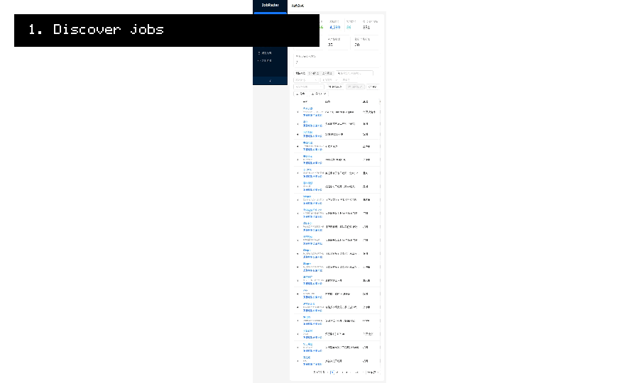
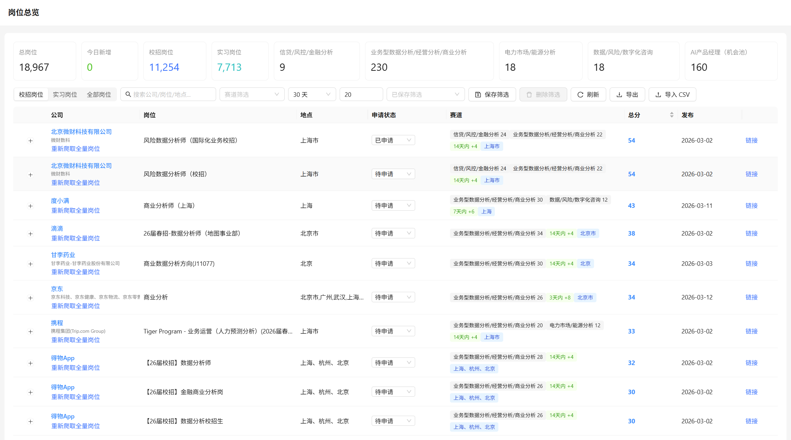
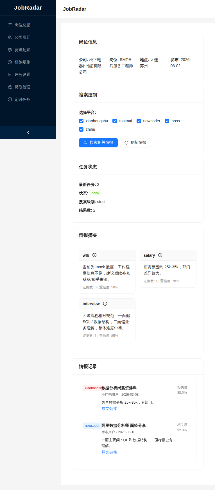
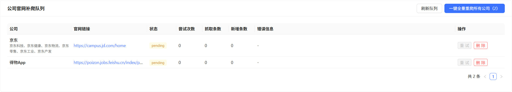

# JobRadar

> From job aggregation to job intelligence.  
> 一个面向目标赛道求职的岗位情报与投递决策系统。

JobRadar 不是一个“盲目抓取全网岗位”的通用爬虫项目。  
它更关注这样一种真实求职场景：

- 目标赛道其实不多，比如互联网、电商、数据分析、风控、AI 产品等
- 真正值得持续关注的公司相对集中
- 聚合平台往往只能提供“发现线索”，却不能完整支持投递决策
- 岗位选择不只取决于 JD，还取决于地点偏好、岗位新鲜度、成功率、面经、笔试、薪酬讨论等外部情报

因此，JobRadar 想解决的不是“如何抓到更多岗位”，而是：

**如何从碎片化岗位信息中，重建一个更适合定向求职的发现、筛选、评分、情报整合与投递工作流。**

---

## Demo



<p align="center">
  
  
  
</p>

---

## Why I Built This

现有招聘信息平台对求职者并不总是友好，尤其是对于**目标明确、赛道集中的求职者**来说。

我在实际使用中发现了几个问题：

1. 很多聚合岗位信息只有公司，没有足够完整的岗位细节  
2. 很多招聘平台要求在平台内投递，但真正有效的招聘入口往往在公司官网 / 校招官网  
3. 对于明确目标赛道的人来说，重要的不是“抓更多”，而是“盯住对的公司”  
4. 决定是否投递，不只是看 JD 匹配，还要看地点、岗位新鲜度、岗位质量、成功率以及外部讨论信号  

所以我做了 JobRadar，目标是把整个流程串起来：

**岗位发现 → 字段清洗 → 去重入库 → 公司级重爬 → 岗位评分 → 外部情报整合 → 每日投递简报**

---

## What Makes JobRadar Different

### 1. Not just aggregation
JobRadar 会从多个岗位聚合来源收集岗位信息，但**聚合平台只是发现线索，不是终点**。  
很多平台只能帮助定位目标公司，真正的投递入口仍然需要回到公司官网或校招官网。

### 2. Not just blind crawling
JobRadar 的思路不是持续无差别抓取，而是支持**围绕重点公司进行定向追踪**。  
当前端发现某家公司值得持续关注时，可以一键将其加入“下次全量重爬”列表。

### 3. Not just collection
JobRadar 不只是保存岗位数据，还会根据多种因素做**加权评分**，帮助用户确定投递优先级。  
评分因素可以包括：

- 关键词匹配度
- 目标地点偏好
- 岗位新鲜度
- 赛道相关性
- 其他自定义偏好因素

### 4. Not just structured job data
真实的岗位决策信息，很多并不在 JD 里。  
因此 JobRadar 还会整合外部非结构化信息，例如：

- 面经
- 笔试经验
- 岗位 / 团队讨论
- 薪酬待遇讨论
- 社区舆情与候选人反馈

---

## Core Features

### 多源岗位聚合
从多个岗位来源收集职位与公司信息，用于构建初始候选池。

### 字段清洗与去重
对不同来源的岗位进行字段规范化、清洗和去重，减少重复岗位和脏数据影响。

### 数据库存储与后端服务
将岗位、公司、标签、状态等信息存入数据库，并通过后端 API 统一提供管理能力。

### 前端岗位管理界面
通过前端界面查看岗位列表、岗位详情、筛选结果和投递状态，形成可操作的工作台。

### 公司级“下次全量重爬”
如果某个公司值得持续关注，可以在前端一键标记，使其在后续爬取任务中被重点全量刷新。

### 官网 / 校招入口补充
支持人工补充公司官网、校招官网等真实入口，逐步从平台线索过渡到官方投递路径。

### 岗位加权评分系统
针对岗位匹配度、地点、新鲜度等维度进行综合打分，帮助排序和优先级判断。

### 外部岗位情报整合
整合来自社区平台的外部讨论内容，用于辅助理解岗位真实情况，包括面试体验、笔试难度、待遇讨论等。

### 每日投递简报
结合岗位数据与外部情报，生成每日投递摘要与岗位分析，帮助用户更高效地安排下一步动作。

---

## Typical Workflow

```text
聚合平台发现岗位 / 公司
        ↓
字段清洗与去重
        ↓
写入数据库
        ↓
前端查看、筛选与管理
        ↓
将重点公司加入下次全量重爬
        ↓
补充官网 / 校招入口
        ↓
岗位评分与优先级排序
        ↓
整合面经 / 笔试 / 薪酬等外部情报
        ↓
生成每日投递简报与岗位分析
```

---

## Design Philosophy

大多数岗位抓取项目优化的是“覆盖率”。  
JobRadar 更关注“决策质量”。

这意味着它的核心假设是：

- 用户通常只关注少数几个目标赛道
- 这些赛道中的重点公司往往比较集中
- 官方招聘入口比平台内二次包装入口更重要
- 排序和筛选比单纯扩充数据量更重要
- 外部讨论与社区情报会显著影响投递决策

一句话概括：

**JobRadar 更像一个求职情报系统，而不是单纯的岗位抓取器。**

---

## Architecture

项目整体可以理解为四层：

### 1. Data Ingestion Layer
负责从不同来源获取信息，包括：
- 聚合岗位来源
- 公司官网 / 校招官网
- 外部讨论与内容平台

### 2. Processing Layer
负责数据处理与标准化，包括：
- 字段清洗
- 去重
- 标签化
- 加权评分
- 情报整合

### 3. Application Layer
负责对外提供交互能力，包括：
- Backend API
- Database
- Frontend Dashboard

### 4. Intelligence Output Layer
负责形成用户可直接行动的输出，包括：
- 每日投递简报
- 岗位分析
- 优先级建议
- 后续跟进线索

---

## Screenshots

当前仓库建议保留以下 3 张图：

1. 岗位列表页：`docs/screenshots/dashboard.png`
2. 岗位情报页：`docs/screenshots/job_intel.png`
3. 公司展开页：`docs/screenshots/company_expand.png`

```text
docs/
└── screenshots/
    ├── dashboard.png
    ├── job_intel.png
    └── company_expand.png
```

如需进一步提升 GitHub 首页表现力，建议再补：
- `docs/demo.gif`
- 岗位评分详情图
- 爬取管理 / 公司重爬队列图

---

## Quick Start

以下命令以本地 Docker 部署为例：

```bash
docker compose up --build -d
```

启动后可访问：

- Frontend: [http://localhost:5173](http://localhost:5173)
- Backend: [http://localhost:8001](http://localhost:8001)
- API Docs: [http://localhost:8001/docs](http://localhost:8001/docs)

最小体验路径建议：

1. 打开岗位总览，观察岗位池与筛选项  
2. 选择一条岗位，进入 Job Intel 页面  
3. 触发情报搜索，查看面经 / 薪资 / 工作强度摘要  
4. 回到公司展开或爬取管理页，理解后续跟踪链路

---

## Project Structure

当前项目的实际结构更接近：

```text
JobRadar/
├── frontend/                    # React + Vite 前端界面
├── backend/                     # FastAPI 后端与业务逻辑
│   ├── app/
│   │   ├── routers/             # API 路由
│   │   ├── services/            # 抓取、评分、情报、导出等服务
│   │   ├── models.py            # SQLAlchemy 模型
│   │   ├── schemas.py           # 主业务 schema
│   │   └── schemas_job_intel.py # Job Intel schema
│   ├── data/                    # SQLite 数据文件
│   └── reports/                 # 生成的报告
├── docs/                        # README 素材与设计文档
├── docker-compose.yml           # 标准 Docker 启动配置
├── docker-compose-frontend-only.yml
├── auto_login_scraper.py        # 历史兼容脚本
└── config.yaml                  # 配置入口
```

---

## Key Use Cases

JobRadar 特别适合以下场景：

- 目标赛道明确的求职者
- 重点关注少数公司和行业的用户
- 希望尽量走官网 / 校招官网投递路径的人
- 希望对岗位进行优先级排序，而不是单纯海投的人
- 想把岗位、面经、薪酬讨论、日报整合成一套工作流的人

---

## Current Status

当前项目已围绕以下核心链路展开：

- 多源岗位发现
- 字段清洗与去重
- 数据库存储
- 后端 API
- 前端交互界面
- 公司级重爬控制
- 岗位加权评分
- 外部情报整合（Phase 1 / 2 进行中）
- 每日简报生成

核心闭环已经形成：

**discover → clean → target → score → enrich → decide → apply**

---

## Roadmap

接下来计划持续完善的方向包括：

- 更自动化的官网 / 校招官网入口发现
- 更强的岗位去重与公司归并
- 更丰富的岗位评分特征
- 公司级知识图谱与跟踪视图
- 更强的外部情报聚合能力
- 牛客 / 小红书优先的真实平台接入
- 更可配置的日报生成与推荐逻辑
- 更细粒度的投递状态管理

---

## Tech Stack

基于当前项目实际情况：

- Frontend: React + TypeScript + Ant Design + Vite
- Backend: FastAPI + SQLAlchemy
- Database: SQLite
- Crawling: Python-based crawlers + Playwright / requests
- Deployment: Docker / Docker Compose
- Reporting / Automation: OpenClaw-assisted workflow

---

## Notes

- 本项目更关注个人求职决策支持，而非简单岗位搬运
- 聚合岗位信息仅作为发现与线索来源之一
- 某些来源可能需要人工登录、扫码或额外验证流程
- 外部社区信息仅作为辅助判断，不构成绝对事实依据
- 当前 `Job Intel` 已有基础可运行版本，但真实平台接入仍在持续推进

---

## Contributing

欢迎提出 issue、建议或改进思路。

如果你希望参与开发，建议将协作规范单独放到 [CONTRIBUTING.md](./CONTRIBUTING.md)，例如：

- 分支命名规范
- Commit 规范
- PR 规范
- Issue 模板
- Changelog 维护方式

这样可以避免把 GitHub 首页变成纯开发手册。

---

## License

根据你的实际情况填写，例如：

```text
MIT License
```

---

## Acknowledgements

这个项目的部分思路来自于真实求职过程中的长期观察与实践，也参考了部分外部项目在内容获取与工作流设计上的启发，例如：

- 面向岗位发现的多源聚合思路
- 面向内容整合的 MediaCrawler 类方法
- 面向日报输出的自动化分析工作流

JobRadar 试图把这些分散的方法整合成一套更贴近真实求职决策的系统。

---

## Tagline Options

你可以从下面选一句放在仓库顶部：

- **From job aggregation to job intelligence**
- **Not just scraping jobs, but deciding where to apply**
- **A focused application workflow for targeted career tracks**
- **Turn fragmented job data into actionable application strategy**

---

## What You Should Do Next

如果你要让这个 GitHub 首页真正“能打”，你下一步最该补的是：

1. `docs/demo.gif`
2. 一张岗位评分 / 详情页截图
3. 一张公司重爬队列或日报页截图

这样这个 README 就会从“结构完整”升级成“首页即产品说明书”。
ion strategy**

---

## What You Should Do Next

如果你要让这个 GitHub 首页真正“能打”，你下一步最该补的是：

1. `docs/demo.gif`
2. 一张岗位评分 / 详情页截图
3. 一张公司重爬队列或日报页截图

这样这个 README 就会从“结构完整”升级成“首页即产品说明书”。
