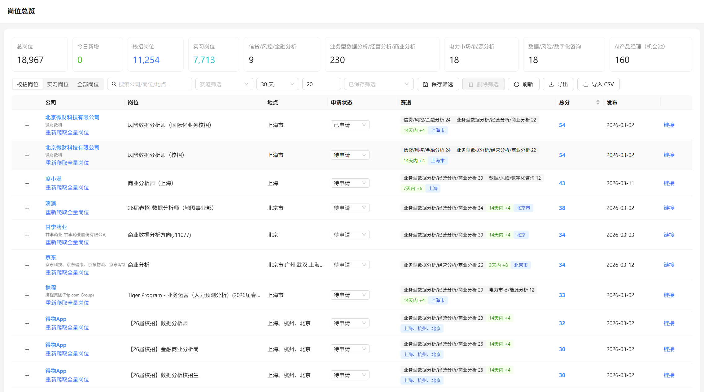
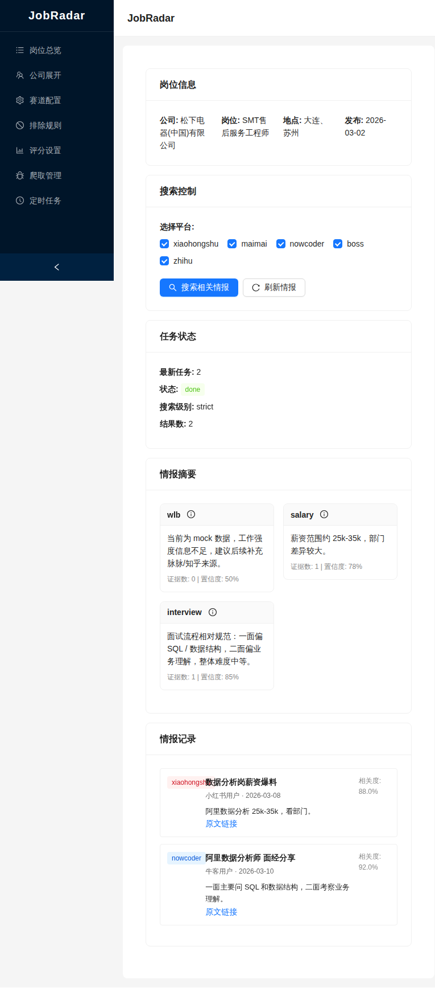
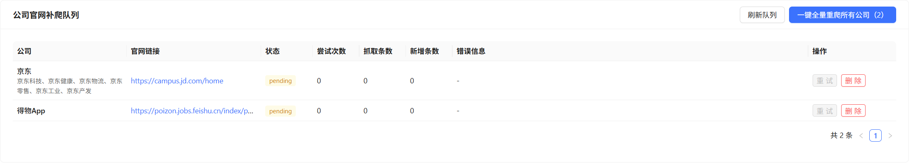
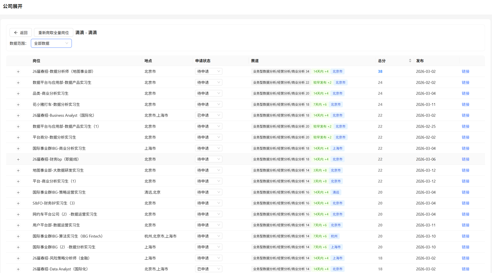
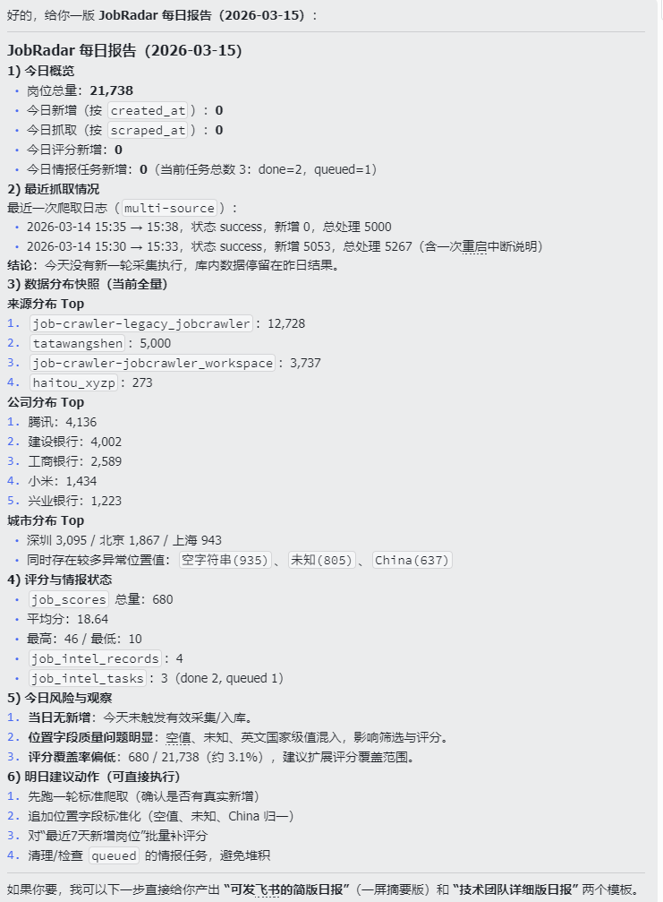

<div align="center">

# 🎯 JobRadar · AI 校招岗位雷达

**周传博 · Chuanbo Zhou** — 数据分析 / AI 产品方向

[在线 Demo](https://jobcopilot.top) ·
[交互原型](https://slackness1.github.io/JobRadar/prototype/) ·
[案例研究](https://slackness1.github.io/JobRadar/prototype/JobRadar%20Case%20Study.html) ·
[English](./README_EN.md)

</div>

---

## 📽 产品演示

<div align="center">

<video src="https://github.com/Slackness1/JobRadar/raw/main/docs/assets/JobRadar.mp4" controls poster="https://github.com/Slackness1/JobRadar/raw/main/docs/assets/jobradar-hero.png" width="720"></video>

<sub>▲ 完整演示约 1 分钟 · 如未自动播放：<a href="https://github.com/Slackness1/JobRadar/raw/main/docs/assets/JobRadar.mp4">点击下载</a></sub>

</div>

---

## 🎨 三个可点击的入口

| 看什么 | 链接 | 说明 |
|---|---|---|
| 🌐 **线上 Demo** | [jobcopilot.top](https://jobcopilot.top) | 真实运行的全栈产品（前端 + 后端 + 每日 08:00 自动爬虫） |
| 🎨 **高保真原型** | [HiFi Prototype](https://slackness1.github.io/JobRadar/prototype/JobRadar%20HiFi.html) | 落地页 + 上传流程 + 工作台三段核心交互 |
| 📖 **案例研究** | [Case Study](https://slackness1.github.io/JobRadar/prototype/JobRadar%20Case%20Study.html) | 设计决策、信息架构、迭代过程完整复盘 |
| 🎭 **模拟面试原型** | [Mock Interview](https://slackness1.github.io/JobRadar/prototype/Mock%20Interview%20%C2%B7%20AI%20Interviewer.html) | 设备检测 + AI 面试官 + 沉浸式面试舞台 |

---

## ❓ 这个产品在解决什么问题

传统聚合平台擅长「展示岗位」，但不擅长「支持决策」。

JobRadar 的出发点是：

- 目标赛道用户通常关注的是**少量重点公司**，而不是全网噪声
- 平台内投递入口不一定是最优路径，很多场景需要回到**官网 / 校招官网**
- 真正影响投递决策的，除了 JD，还包括**时效、质量、成功率与外部信号**
- 简历投出去之前，应该先有一次**模拟面试和针对性的 rewriting**

所以 JobRadar 不追求「抓得最多」，而追求 **「投得更准」**。

---

## ✨ 核心能力

| 能力模块 | 说明 | 当前状态 |
|---|---|---|
| 多源岗位发现 | 30+ 公司官网 + Tata 聚合 + 海投网，每日 08:00 定时抓取 | ✅ 已支持 |
| 字段清洗与去重 | 标准化字段 + LLM 二次分类 + 公司名归并 | ✅ 已支持 |
| 公司级重爬队列 | 重点公司定向更新，按行业分 4 大 tier 编排 | ✅ 已支持 |
| 简历 Copilot | 上传 → LLM 解析结构化档案 → 多维评分 → DeepSeek rerank | ✅ 已支持 |
| 经历改写助手 | 多轮对话 + 一键应用 rewrite + 数字捏造防护 | ✅ 已支持 |
| 模拟面试 | 基于推荐岗位定制题目 + Aliyun ASR/TTS 全语音交互 + 自动报告 | ✅ 已支持 |
| 站点监控 | 公司爬虫日维度状态 + 失败 LLM 诊断 + 红 / 黄 / 绿告警 | ✅ 已支持 |
| 每日报告 | 「新增 + 变化 + 建议动作」LLM 摘要 | 🟡 进行中 |

---

## 🔄 用户流

```text
上传简历
  → LLM 解析结构化档案（教育 / 实习 / 项目 / 技能）
  → 选择目标赛道 + 偏好（地点、公司类型、是否接受异地）
  → 系统从最新岗位库中预筛 → 多维评分 → 14 天内 JD 情报增强 → DeepSeek rerank
  → 给出 Top-N 推荐 + 「为什么推荐 / 优势 / 风险」结构化解释
  → 多轮对话改简历（针对推荐岗位定向 rewrite）
  → 进入模拟面试 → 出报告 → 投递
```

闭环：`discover → clean → score → enrich → match → rewrite → interview → apply`

---

## 🖼 截图

### 工作台


### 岗位详情 / 情报页


### 公司爬虫监控


### 评分详情


### 每日报告


---

## 🧱 架构设计

```text
Resume Copilot Web (Next.js 16)        Admin Frontend (Vite + React 19)
        ↓ /api/*                                ↓ /api/*
              FastAPI Backend (port 8000)
                       ↓
        ┌──────────────┼──────────────┐
        ↓              ↓              ↓
    SQLite (WAL)   APScheduler    LLM Layer
    + Alembic      (08/09/09:35   (DeepSeek V4 Flash/Pro
    + 周度备份      Asia/Shanghai)  + Tavily + Firecrawl
                                  + DashScope ASR/TTS)
                       ↓
              Crawler Layer (30+ company portals)
                       ↓
              Enrichment Layer (LLM tagging / scoring / intel)
                       ↓
              Reporting Layer (digest / daily briefing)
```

模块说明：
- **Resume Copilot Web** — 用户面：上传 / 解析 / 推荐 / 改写 / 模拟面试
- **Admin Frontend** — 管理面：岗位库 / 评分规则 / 爬虫监控 / 调度器
- **Backend** — 数据管理 + 任务编排 + 简历 / 面试 LLM 工作流
- **Crawler** — 多来源抓取 + 公司级重爬队列 + LLM 字段补全
- **Enrichment** — 多维评分 + JD 情报快搜 + 14 天 TTL 缓存
- **Reporting** — 每日 LLM digest + 报告导出

---

## 🛠 技术栈

| 层 | 技术 |
|---|---|
| 后端 API | FastAPI · SQLAlchemy · Alembic · APScheduler · Pydantic v2 |
| 数据库 | SQLite (WAL + busy_timeout) · 周度增量备份 |
| 用户前端 | Next.js 16 · React 19 · Tailwind CSS 4 · Ant Design 6 |
| 管理前端 | Vite · React 19 · React Router 7 · Ant Design 6 |
| 爬虫 | Python · Playwright · requests · LLM 字段分类 |
| LLM | DeepSeek V4 Flash / Pro · Tavily · Firecrawl · Jina · Brave |
| 语音栈 | DashScope (Paraformer realtime + CosyVoice v2) |
| 部署 | Ubuntu VPS · systemd · nginx · HTTP basic auth |

---

## ⚡ 快速开始

### 方式 1：Docker（推荐）
```bash
docker compose up --build -d
```

启动后访问：
- Resume Copilot Web: http://localhost:3001
- Admin Frontend: http://localhost:5173
- Backend API: http://localhost:8001
- API Docs: http://localhost:8001/docs

### 方式 2：本地三端开发

```bash
# 后端
cd backend && pip install -r requirements.txt
uvicorn app.main:app --reload --port 8000

# 用户前端
cd resume-copilot-web && npm install && npm run dev    # → :3001

# 管理前端
cd frontend && npm install && npm run dev              # → :5173
```

最小 `.env.local`（放在 `backend/`）：

```
RESUME_COPILOT_BASE_URL=https://api.deepseek.com/v1
RESUME_COPILOT_API_KEY=sk-...
RESUME_COPILOT_MODEL_NAME=deepseek-chat
TAVILY_API_KEY=tvly-...
FIRECRAWL_API_KEY=fc-...
DASHSCOPE_API_KEY=sk-...
```

详细配置见 [CLAUDE.md](./CLAUDE.md)。

---

## 🗺 路线图

- [ ] 完善官网/校招入口自动发现能力
- [ ] 增强公司归并与岗位去重准确率
- [ ] 扩展评分特征（技能画像、时效权重、历史反馈）
- [ ] 强化外部情报聚合（更多平台、结构化摘要）
- [ ] 支持更细粒度的投递状态与跟进提醒
- [ ] 增加调度可观测性（失败告警、任务看板）

---

## 📦 我的其他作品

| 项目 | 简介 |
|---|---|
| [daily_stock_analysis](https://github.com/Slackness1/daily_stock_analysis) | LLM 驱动的 A/H/美股每日分析器：多源行情 + 实时新闻 + Gemini 决策 + 多渠道推送 |
| [ab-test-dashboard](https://github.com/Slackness1/ab-test-dashboard) | Streamlit 搭建的交互式 A/B 测试看板 |
| [Health-analytics](https://github.com/Slackness1/Health-analytics) | 健康数据分析探索 |
| [StockRadar](https://github.com/Slackness1/StockRadar) | 个股雷达 · 早期版本 |

---

<div align="center">
<sub>📍 英国 · 求职中 · 欢迎沟通校招 / 实习机会 · <a href="mailto:shygod5173.1@gmail.com">shygod5173.1@gmail.com</a></sub>
</div>
