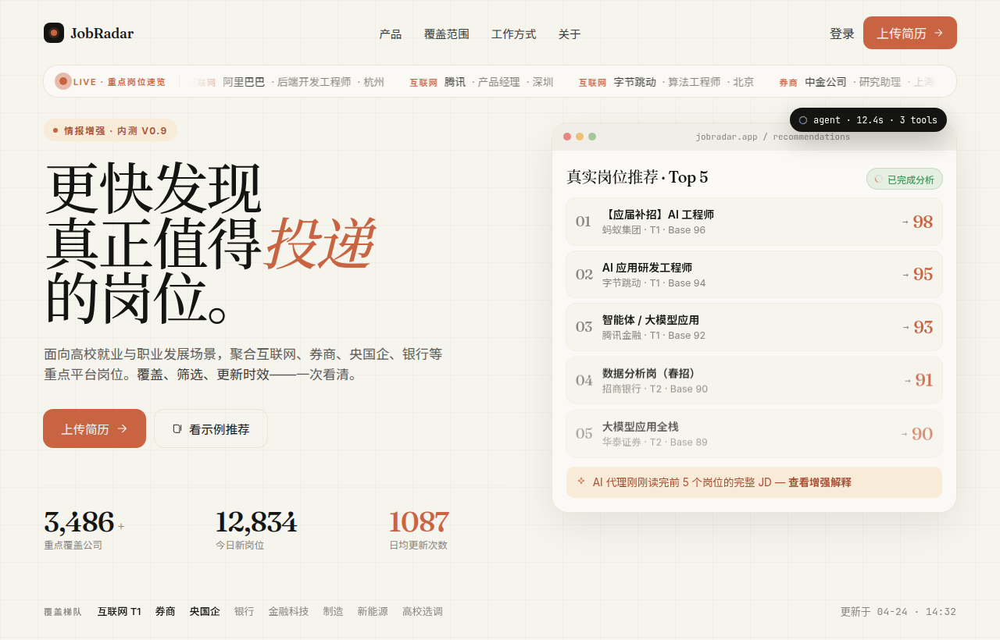
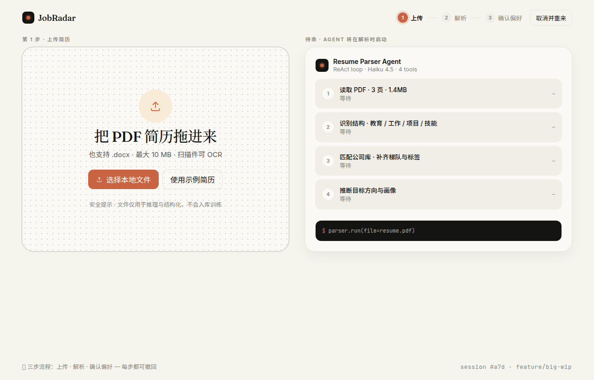
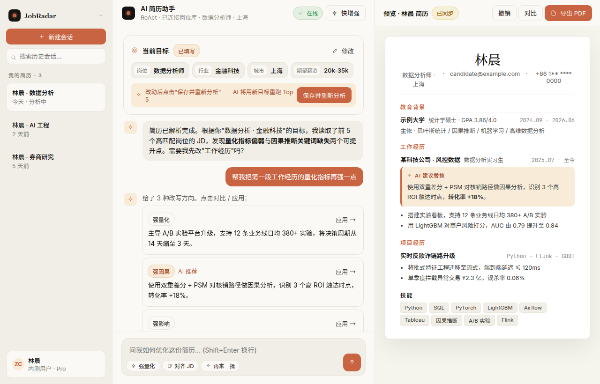
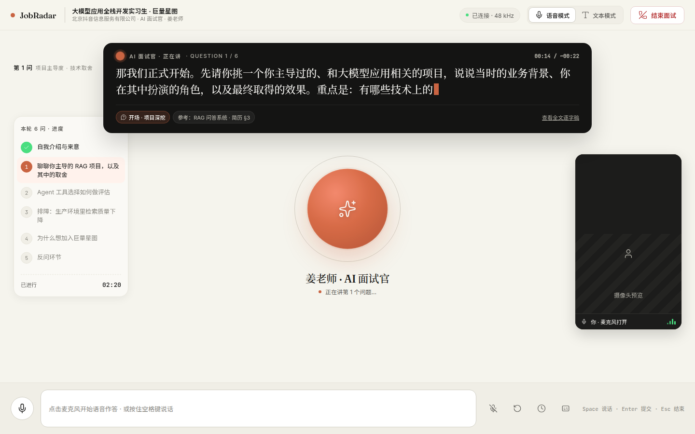
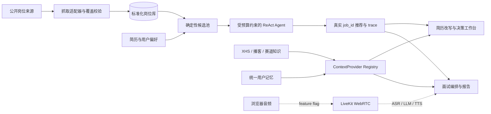

<div align="center">

# JobRadar

**面向中国校招与职业选择的、由真实岗位数据驱动的求职决策 Agent**

从岗位发现、个性化推荐、简历改写，到针对目标岗位的模拟面试。

[在线产品](https://jobcopilot.top) · [功能状态](#真实功能状态) · [快速开始](#快速开始) · [Voice Agent 验收](docs/voice-agent-acceptance-2026-08-16.md)

</div>



<p align="center"><sub>高保真产品原型。岗位、分数与统计数字为演示数据，不代表当前线上数据。</sub></p>

## JobRadar 在做什么

传统岗位平台回答“现在有哪些岗位”，JobRadar 更想回答三个后续问题：

1. **以我的经历和目标，哪些岗位真的值得投？**
2. **为什么推荐，依据来自哪条 JD、哪段经历和哪类公司情报？**
3. **决定投递以后，简历和面试应该怎样针对这个岗位准备？**

因此它不是一个套着聊天框的岗位爬虫，而是一条可追溯的求职决策链：

```text
公开岗位发现 → 标准化 / 去重 / 覆盖诊断 → 简历与偏好建模
→ 受约束的 Agent 调研与选择 → 岗位解释 → 简历改写
→ 定制模拟面试 → 事实型反馈报告
```

## 为什么值得 Star

**数据基座是地基，但不是这个项目唯一、甚至不是最容易复用的价值。** JobRadar 把四类通常分散的工程放进了一个真实垂直场景：

- **可维护的岗位数据工程**：配置驱动的抓取适配器、字段归一、去重、来源分层、可疑零结果检测和抓取证据留存。
- **受约束的垂直 Agent**：先由规则召回候选池，再让 ReAct Agent 在工具预算内检索、查看 JD、读取公司情报，最终只能提交真实候选池中的 `job_id`。
- **上下文与长期记忆**：XHS、播客、赛道知识和用户记忆通过 purpose-aware `ContextProvider` 注册表按场景供给，而不是把所有内容无差别塞进 prompt。
- **评测先行的模拟面试**：自适应提问、并行评分与追问、证据化报告，以及带取消、打断、降级和隐私边界的实时语音链路。

如果你在做 **Agent 应用、RAG、实时语音、招聘产品或爬虫可靠性**，这个仓库的价值更接近一份可运行的垂直 Agent 参考实现，而不是一份会迅速过期的数据包。

## 产品界面

### 上传与结构化解析



### 岗位决策与简历工作台



工作台把岗位约束、Agent 对话、推荐证据和简历改写放在同一条决策上下文中。图中姓名与履历均为虚构演示数据。

### 实时模拟面试



该图是交互原型，不是线上通话实录。设备检测界面见 [mock-interview-device-check-prototype.png](docs/screenshots/product/mock-interview-device-check-prototype.png)。

## 真实功能状态

| 模块 | 已实现 | 当前边界 |
| --- | --- | --- |
| 岗位数据基座 | 公开来源抓取、ATS/站点适配、标准化、去重、评分、调度、覆盖与失败诊断 | 生产数据库和受限来源原始数据不随仓库发布 |
| 简历与偏好 | PDF/DOCX 解析、结构化档案、目标方向与地点/行业/薪资偏好 | 高质量解析与生成需要兼容 OpenAI API 的模型凭证 |
| 岗位推荐 Agent | 规则候选池、`search_candidates`、`inspect_jobs`、`get_company_intel`、工具预算、执行 trace、受约束 finalize 与 fallback | XHS 向量检索目前不是 ReAct 推荐主路径 |
| 简历 Copilot | 多轮改写、差异预览、一键应用、捏造风险提示、跨会话用户记忆 | 输出仍需用户确认，不能替代事实核验 |
| RAG / 外部情报 | XHS、播客、赛道知识与记忆 Provider；按 chat/interview/intel 等 purpose 路由 | 私有语料与派生索引不作为公共数据集分发 |
| 模拟面试 | 岗位定制题目、自适应追问、并行编排、评分、报告与 Voice Facts V2 | 反馈只展示可测事实，不输出未经校准的性格/自信标签 |
| Realtime Voice Agent | LiveKit WebRTC、流式 ASR/TTS、播放取消、自动轮次、barge-in、重连与 legacy fallback 均已实现并受 feature flag 控制 | Gate B 真人中文语料和 Gate C 真实 LiveKit 房间验收尚未完成 |

语音链路的实现、失败复盘和验收边界见 [阶段复盘](docs/voice-agent-phase-retrospective-and-acceptance-2026-08-16.md) 与 [验收清单](docs/voice-agent-acceptance-2026-08-16.md)。

## Agent 架构


```mermaid
flowchart LR
    S[公开岗位来源] --> C[抓取适配器与覆盖校验]
    C --> D[(标准化岗位库)]
    R[简历与用户偏好] --> P[确定性候选池]
    D --> P
    P --> A[受预算约束的 ReAct Agent]
    A --> J[真实 job_id 推荐与 trace]
    J --> W[简历改写与决策工作台]

    X[XHS / 播客 / 赛道知识] --> K[ContextProvider Registry]
    M[统一用户记忆] --> K
    K --> W
    K --> I[面试编排与报告]
    J --> I

    B[浏览器音频] -. feature flag .-> L[LiveKit WebRTC]
    L -. ASR / LLM / TTS .-> I
```

### 1. 推荐不是一次黑盒 rerank

系统先用确定性规则形成候选池，再允许 Agent 在有限预算内调用三个只读工具。`finalize` 会校验岗位是否真的来自候选池；预算耗尽、模型格式错误或工具失败时走可解释 fallback。这样既保留模型的调研与比较能力，也给幻觉、成本和尾延迟设置边界。

### 2. RAG 按任务路由

`ContextProvider` 以 `purpose`、查询和用户上下文决定是否取数。XHS 更适合提供公司体验、招聘口径和候选人视角，播客更适合补充职业路径与行业方法，用户记忆则提供个人证据。Provider 失败不会拖垮主流程。

### 3. 面试是一条有状态编排链

每轮回答并行进入评分、追问决策和下一题准备；迟到结果通过轮次边界隔离。实时语音采用可替换的 pipeline 路线，并保留 legacy 链路作为降级，而不是把传输、ASR、LLM、TTS 和业务状态绑死在一个模型里。

## 数据与合规边界

- 只面向合法、公开、可访问的岗位来源；优先官方招聘站和公开 ATS。
- 不绕过验证码、登录封禁或站点风控，并应遵守目标站点条款与速率限制。
- 仓库发布的是抓取器、配置、数据模型、样例和评测资产；**线上生产库、学生数据、私有 XHS 语料与音频不在仓库中**。
- 经用户明确授权的面试音频才会短期保存；衍生分析支持删除和过期清理。

这也意味着：当前“持续维护的数据基座”是产品护城河，但还不是一个开箱即用、持续更新的公共数据集。如果未来把数据本身作为主要开源卖点，需要另外发布有授权、带时间戳和来源说明的快照。

## 技术栈

| 层 | 技术 |
| --- | --- |
| 用户端 | Next.js 16、React 19、TypeScript、Tailwind CSS、Ant Design |
| 管理端 | Vite、React 19、TypeScript、Ant Design |
| 后端 | FastAPI、SQLAlchemy、Alembic、Pydantic、APScheduler |
| 数据 | SQLite WAL、结构化配置、向量化知识索引 |
| Agent / RAG | OpenAI-compatible LLM、budgeted ReAct、ContextProvider registry、统一记忆 |
| 爬虫 | Python、Requests、Playwright、ATS / 站点专用 adapter |
| 语音 | LiveKit Agents、Silero VAD、DashScope Paraformer、Qwen3-TTS / CosyVoice、WebRTC |

## 快速开始

### Docker：后端与管理端

当前 `docker-compose.yml` 启动 FastAPI 和旧管理端，不包含 Next.js 用户端。

```bash
touch .env
docker compose up --build -d
```

- Admin Frontend: <http://localhost:5173>
- Backend API: <http://localhost:8001>
- API Docs: <http://localhost:8001/docs>

### 本地运行完整用户链路

```bash
# Terminal 1: backend
cd backend
python3 -m venv .venv
.venv/bin/pip install -r requirements.txt
.venv/bin/playwright install chromium
PYTHONPATH=. .venv/bin/uvicorn app.main:app --reload --port 8000

# Terminal 2: Next.js user app
cd resume-copilot-web
npm ci
RESUME_COPILOT_BACKEND_URL=http://127.0.0.1:8000 npm run dev
```

打开 <http://localhost:3001>。Agent 功能至少需要在仓库根目录或 `backend/` 的 `.env.local` 中配置：

```dotenv
RESUME_COPILOT_LLM_BASE_URL=https://api.deepseek.com/v1
RESUME_COPILOT_LLM_API_KEY=your-key
RESUME_COPILOT_LLM_MODEL=deepseek-chat
```

语音功能还需要 `DASHSCOPE_API_KEY`；LiveKit 路线默认关闭，需额外配置 `LIVEKIT_URL`、`LIVEKIT_API_KEY`、`LIVEKIT_API_SECRET` 和对应 feature flags。当前 LiveKit adapter 需要原始 PCM，因此启用该路线时 `DASHSCOPE_TTS_MODEL` 必须选择支持 PCM 流式输出的 CosyVoice 模型。

## 仓库结构

```text
backend/             FastAPI、Agent、RAG、面试编排、语音与爬虫
resume-copilot-web/  面向求职者的 Next.js 产品
frontend/            岗位、评分、调度与爬虫管理端
docs/                架构、评测报告、复盘与产品原型
scripts/             数据导入、抓取、验证和运维脚本
```

## 评测与工程记录

- [Realtime Voice Agent Spec](docs/realtime-voice-agent-spec-2026-08-16.md)
- [Voice Agent 三道验收](docs/voice-agent-acceptance-2026-08-16.md)
- [Voice Agent 阶段复盘与未完成项](docs/voice-agent-phase-retrospective-and-acceptance-2026-08-16.md)
- [Mock Interview 独立评审](docs/eval-full-loop-reports/mock-interview-independent-review-2026-05-22/independent-summary.md)
- [Workspace Coach 独立评审](docs/eval-full-loop-reports/workspace-coach-independent-review-2026-05-22/independent-summary.md)

## 授权状态

仓库目前尚未加入开源许可证。在 `LICENSE` 明确之前，代码可供阅读和评估，但不应默认拥有复制、修改或再分发授权。许可证选择是开放外部贡献前必须补齐的一步。

---

<div align="center">

Maintained by [Chuanbo Zhou](https://github.com/Slackness1), focused on AI Agent, realtime voice and backend product engineering.

</div>
