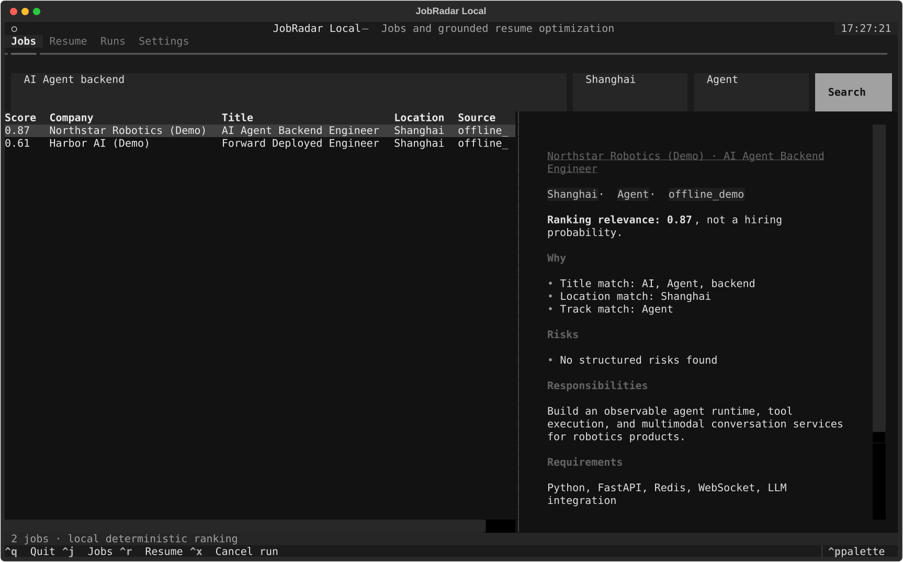

# JobRadar Local TUI

JobRadar Local 是完整 JobRadar 产品的轻量本地入口，只提供两条工作流：

1. 导入并检索本地岗位；
2. 针对目标 JD 生成有证据引用、可逐条审阅的简历 patch。

它不启动 FastAPI、Next.js、管理端、爬虫调度器或语音服务，也不会自动投递。



## 安装

需要 Python 3.11 或更高版本。

### uv tool

```bash
uv tool install git+https://github.com/Slackness1/JobRadar.git
jobradar init
jobradar doctor
jobradar tui
```

### pipx

```bash
pipx install git+https://github.com/Slackness1/JobRadar.git
jobradar init
jobradar doctor
jobradar tui
```

### 从源码运行

```bash
git clone https://github.com/Slackness1/JobRadar.git
cd JobRadar
python3 -m venv .venv-local
.venv-local/bin/pip install -e .
.venv-local/bin/jobradar init
.venv-local/bin/jobradar tui
```

Windows PowerShell 将 `.venv-local/bin/jobradar` 替换为
`.venv-local\Scripts\jobradar.exe`。

## 第一次运行

`jobradar init` 会：

- 使用 XDG 目录创建配置和数据工作区；
- 初始化 SQLite WAL 和 FTS5；
- 创建 resumes、jobs、runs、exports 和 backups 目录；
- 在空库中导入 6 条明确标记为演示的岗位。

默认目录：

```text
~/.config/jobradar/config.toml
~/.local/share/jobradar/
  jobradar.db
  workspace/
    jobs/imports/
    resumes/original/
    resumes/versions/
    runs/<run_id>/manifest.json
    runs/<run_id>/events.jsonl
```

通过 `JOBRADAR_HOME` 和 `JOBRADAR_CONFIG_HOME` 可以覆盖目录。安装包与用户工作区物理分离，升级不会覆盖原始简历、岗位导入、收藏、Memory 或 Run 记录。

## 岗位检索

支持 CSV、JSON、JSONL 和包含 `jobs` 表的 JobRadar SQLite：

```bash
jobradar jobs import ./jobs.csv
jobradar jobs import ./jobs.jsonl
jobradar jobs import ./jobradar.db
jobradar jobs search "AI Agent 后端" --location 上海
jobradar jobs search "LLM Platform" --track 后端 --limit 30
```

导入器兼容以下常见字段别名：

- `job_id` / `id`
- `job_title` / `title` / `position`
- `detail_url` / `url` / `apply_url`
- `job_duty` / `description`
- `job_req` / `requirements`
- `sub_category` / `canonical_track` / `track`

导入的原始文件会按内容哈希复制到工作区，便于追踪来源。排序分数表示当前查询的相关性，不是录用概率。

## 模型配置

岗位检索完全离线，不需要模型。简历 patch 使用 OpenAI-compatible API。

### Ollama

```bash
ollama serve
ollama pull qwen3:8b
jobradar config model \
  --base-url http://127.0.0.1:11434/v1 \
  --model qwen3:8b
jobradar doctor --check-model
```

### 远程模型

```bash
export JOBRADAR_LLM_API_KEY="your-key"
jobradar config model \
  --base-url https://api.example.com/v1 \
  --model your-model \
  --api-key-env JOBRADAR_LLM_API_KEY \
  --allow-remote
jobradar doctor --check-model
```

远程 endpoint 必须显式 `--allow-remote`。API Key 只从环境变量读取，不写入 TOML、SQLite、Run Manifest 或日志。

## 简历优化

TUI 支持 PDF、DOCX、Markdown 和 TXT。命令行也可以运行：

```bash
jobradar resume parse ./resume.pdf
jobradar resume optimize ./resume.pdf --job-id demo-agent-backend-sh
jobradar resume optimize ./resume.md --jd-file ./target-jd.txt --json
```

明确希望接受全部通过证据门的 patch 时，可以使用：

```bash
jobradar resume optimize ./resume.md --jd-file ./target-jd.txt --accept-all
```

默认不会修改或覆盖原始简历。TUI 中需要逐条 Accept；Blocked patch 不能接受。导出结果是新的 Markdown 版本。

## 防编造与 Context

每次简历调用都编译三层 Context：

- Stable Prefix：事实、工具和输出契约；
- Run Snapshot：简历 hash、目标 JD hash、岗位和 workflow 版本；
- Turn Dynamic：当前证据块、按需 Memory 和任务输入。

Memory 数据契约支持 L0-L3。当前 Alpha 会写入 L1 简历索引和 L3 原文证据，
并在简历工作流中按 scope 召回；L0 用户约束和 L2 已确认经历的自动提取仍是后续项。
模型返回后执行：

1. `target_block_id` 是否存在；
2. `before` 是否与原简历逐字一致；
3. `evidence_refs` 是否来自本次简历；
4. 是否新增原简历没有的数字；
5. 是否把 JD 中缺失技能写成候选人已有事实。

未通过的 patch 标记为 `blocked`。模型不可用时，系统仍返回本地关键词诊断，并明确标记为 degraded。

## Docker

```bash
docker compose -f docker-compose.tui.yml build
docker compose -f docker-compose.tui.yml run --rm jobradar init
docker compose -f docker-compose.tui.yml run --rm jobradar doctor
docker compose -f docker-compose.tui.yml run --rm jobradar tui
```

用户数据保存在仓库旁的 `.jobradar-local/`，配置保存在 `.jobradar-config/`。这两个目录已被 `.gitignore` 排除。
容器连接宿主机 Ollama 时，将模型地址配置为
`http://host.docker.internal:11434/v1`；Compose 已加入对应的 host gateway。

## 快捷键

| Key | Action |
| --- | --- |
| `Ctrl+J` | Jobs |
| `Ctrl+R` | Resume |
| `Ctrl+X` | 取消当前简历任务 |
| `Ctrl+Q` | 退出 |

## 隐私边界

- 默认遥测关闭；当前版本没有遥测客户端；
- 不连接 JobRadar 线上服务；
- 不包含生产岗位库、私有 XHS 语料、学生数据或音频；
- 不提供 shell、通用文件写入、浏览器控制或自动投递；
- 远程模型调用只发送当前简历证据、目标 JD 和按需 Memory；
- Run Artifact 记录来源 hash 和步骤，不保存 API Key 或隐藏思维过程。

## 开发与测试

```bash
python3 -m venv .venv
.venv/bin/pip install -e '.[dev]'
.venv/bin/ruff check src tests/local_tui
.venv/bin/pytest -q
.venv/bin/python -m build
```

测试覆盖工作区逃逸、原件哈希、导入、中文检索、真实 ID 围栏、收藏/排除、
Context hash、L1/L3 Memory、无依据数字阻断、离线降级、导出和 Textual
桌面/窄终端链路。
