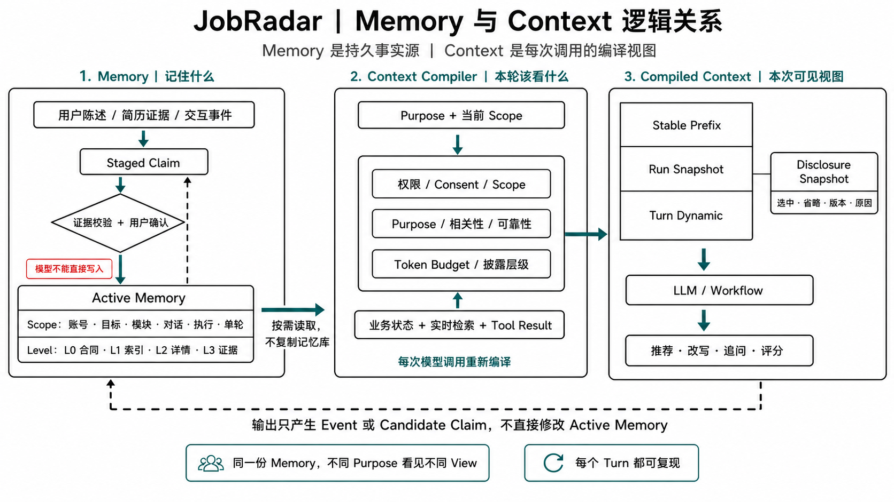

# JobRadar 渐进式记忆披露 PRD

- 状态：Draft，待产品与工程评审
- 日期：2026-08-22
- 产品范围：岗位推荐、Resume Copilot、模拟面试、统一候选人记忆
- 关联 Spec：`career-agent-kernel-implementation-spec-2026-08-21.md`
- 主要读者：FDE / 技术产品经理、AI 工程师、后端、前端、测试
- 核心决策：**统一事实存储，按 Scope 隔离，按 Purpose 渐进披露；不为每个模块复制一套记忆库**

## 0. 一句话结论

JobRadar 的记忆不能只设计成“全局记忆、模块记忆、对话记忆、单轮记忆”四个从大到小的盒子。

这些层级只回答了：

> 这条记忆属于哪里、能活多久？

系统还必须独立回答：

> 当前这个模型调用为什么需要看到它、应该看到摘要还是原始证据？

因此本 PRD 使用两套正交机制：

```text
Memory Scope
决定记忆属于哪个账号、目标、模块、Run 和 Turn

Disclosure Policy
根据当前 Purpose、风险和 Token Budget 决定是否加载，以及披露到哪一层
```

每一次模型调用都会生成独立的 `MemoryDisclosureSnapshot`。同一场对话的第 5 轮和第 6 轮可以看到不同记忆，但它们读取的是同一份权威 Memory Store，而不是复制出两份“轮级记忆”。



图 1：Memory 经过治理后成为持久事实源；Context Compiler 根据当前 Purpose 和 Scope 按需读取，为每次模型调用生成可复现的 Context View。

## 1. 背景与问题

JobRadar 已经有三个可工作的产品模块：

| 模块 | 用户任务 | 当前主要状态载体 |
|---|---|---|
| 岗位推荐 | 找到值得申请的岗位并解释取舍 | Recommendation Run、候选岗位池、反馈与拒绝记录 |
| Resume Copilot | 识别经历、诊断简历、针对岗位改写 | Resume Session、Profile、Plan、Chat Message |
| 模拟面试 | 针对目标岗位练习、追问、评分和复盘 | Interview Session、Turn、Transcript、Report |

三个模块需要共享候选人的真实事实，但不能无条件共享所有局部判断：

- “本科就读于 X 学校”应跨模块共享；
- “只看上海岗位”可能是全局约束，也可能只针对当前求职目标；
- “用户拒绝了某家公司”首先是一次推荐交互，不能立即推断成永久偏好；
- “本场回答缺少量化结果”只能用于面试练习，不能降低岗位推荐分；
- “这一轮请先假设我做过 Java 后端”只能服务当前 Turn，绝不能进入长期事实；
- 同一段经历在简历改写时需要原文数字，在面试追问时只需要 STAR Hook，在岗位推荐时可能只需要技能摘要。

当前 `account_memory` 已经具备结构化 Category、来源、摘要、Payload、确认、Supersession 和 Archive，是本 PRD 的事实基础。当前主要缺口不是存储，而是：

1. Scope 仍主要依赖 `user_key + linked_track + linked_job_id`，不能完整表达目标、模块、Run 和 Turn；
2. 模型推断可能因为自报 Confidence 较高而过早成为 `user_confirmed`；
3. 通用 Reader 主要按 least-used 和 Confidence 选取，不是 Purpose-aware；
4. 没有逐次记录“本轮看见了什么、为什么选中、为什么省略”；
5. Conversation History、业务状态、长期 Memory 的边界不够统一。

## 2. 产品目标

### 2.1 用户目标

1. 用户不必在推荐、简历和面试之间反复解释同一份已确认事实。
2. 系统不会把一次临时表达或模型推测偷偷变成永久画像。
3. 推荐、改写和面试建议都能说明使用了哪些个人事实。
4. 用户可以查看、确认、修改、限定范围、归档和删除记忆。
5. 用户更换求职方向时，旧方向的偏好不会污染新方向。

### 2.2 系统目标

1. 三个模块共用一份账号级事实源，不复制三套长期记忆。
2. 每次模型调用生成可复现的 Memory Disclosure Snapshot。
3. 记忆默认最小披露，只把当前 Purpose 需要的字段发送给模型。
4. 模型推断必须经过 Staging，不得凭 Confidence 自动成为确认事实。
5. Run 内上下文保持稳定；需要改变关键事实时生成新 Revision。

### 2.3 非目标

- 不保存或展示模型隐藏推理；
- 不把完整 Conversation History 当作长期记忆；
- 不把原始音频、完整面试转写复制进账号级 Memory；
- 不为三个模块创建三张互不相通的 Memory 主表；
- 不让 Subagent 直接读写数据库或拥有私有的候选人事实副本；
- 第一版不引入图数据库；
- 第一版不以向量检索替代结构化 Scope、Category 和 Evidence 检索。

## 3. 核心产品模型

### 3.1 一份事实源，六个 Scope 维度

Memory Scope 使用一个选择器元组，而不是只有一个 `scope_type`：

本 PRD 中的“全局记忆”始终指**当前用户账号内全局**，绝不表示跨用户或平台全局。

```text
(user_key, career_goal_id?, workflow?, session_id?, run_id?, turn_id?)
```

| 维度 | 含义 | 示例 |
|---|---|---|
| `user_key` | 所有记忆的 Tenant Owner，必填 | 当前登录用户 |
| `career_goal_id` | 某个求职目标或方向 | 机器人后端、AI 产品经理 |
| `workflow` | 哪个模块可以使用 | recommendation、resume、interview |
| `session_id` | 用户可持续返回的对话或工作区 | 某份简历工作区、某场面试会话 |
| `run_id` | Session 中某次有终态的执行 | 一次重新推荐、一次报告生成 |
| `turn_id` | 某一轮交互 | 第 4 个面试回答 |

空字段表示更广泛的适用范围：

```text
(user, null, null, null, null, null)
= 账号全局

(user, goal_robot_backend, null, null, null, null)
= 机器人后端求职目标

(user, goal_robot_backend, interview, null, null, null)
= 该目标下的面试练习记忆

(user, goal_robot_backend, resume, resume_session_7, null, null)
= 某个持续存在的简历对话

(user, goal_robot_backend, interview, interview_session_123, report_run_2, null)
= 本场面试中的第二次报告执行

(user, goal_robot_backend, interview, interview_session_123, interview_run_1, turn_4)
= 本场面试第 4 轮
```

### 3.2 为什么不能只按四层父子树设计

“模块”和“求职目标”不是天然父子关系。

同一个“机器人后端”目标会同时经过推荐、简历和面试；同一个 Resume Copilot 也可能服务“机器人后端”和“AI 产品经理”两个目标。因此必须把 Goal 和 Workflow 作为两条独立维度。Session 与 Run 也必须分开：Session 是用户持续返回的工作区或对话，Run 是其中一次有明确终态、可以重试或重新执行的任务。

逻辑上可以理解为：

```text
Account
├── Goal: 机器人后端
│   ├── Recommendation Runs
│   ├── Resume Runs
│   └── Interview Runs
└── Goal: AI 产品经理
    ├── Recommendation Runs
    ├── Resume Runs
    └── Interview Runs
```

读取时允许沿当前选择器向上查找祖先 Scope，但禁止读取兄弟 Scope：

```text
当前：机器人后端 / Interview / Session 123 / Run 1 / Turn 4

允许读取：
Turn 4 -> Run 1 -> Session 123 -> Interview + 机器人后端 -> 机器人后端 -> Account

禁止读取：
AI 产品经理 Goal
另一次无关 Interview Run
Resume 模块独有的写作习惯
Recommendation 模块尚未确认的偏好推断
```

### 3.3 Memory、业务状态和对话历史的边界

| 数据 | 权威位置 | 是否属于长期 Memory |
|---|---|---|
| 当前候选岗位池、推荐预算 | Recommendation Run | 否 |
| 当前简历草稿、Plan 状态 | Resume Session / Plan | 否 |
| 当前面试问题、回答、Turn Index | Interview Session / Turn | 否 |
| 用户确认的学校、技能、经历事实 | Account Memory | 是 |
| 用户确认的目标和硬偏好 | Account / Goal Memory | 是 |
| 一次拒绝、一次改写、一次面试表现 | Event / Run Artifact | 默认否 |
| 从多次行为归纳出的稳定倾向 | Staged Claim，确认后才是 | 条件性 |

Conversation History 负责当前对话连续性；Memory 只保存未来跨会话仍值得使用的蒸馏结果。

Session Scope 可以保存“这段对话接下来还要继续使用”的压缩摘要、局部选择和未完成问题，但它仍然不是账号级长期事实。Session 结束后，这些内容要么随保留策略到期，要么经过 Claim Staging 提升到更宽 Scope。

## 4. Memory 类型与生命周期

### 4.1 六类产品记忆

| 类型 | 典型 Category | 默认 Scope | 默认生命周期 |
|---|---|---|---|
| Candidate Contract | identity_fact、明确硬偏好、active goal | Account / Goal | 直到替代或删除 |
| Evidence Memory | evidence、experience、证据支持的 skill_claim | Account / Goal | 直到失效、替代或删除 |
| Strategy Memory | 求职策略、公司类型偏好、写作偏好 | Goal / Workflow | 可复核、可过期 |
| Episodic Summary | 某段对话或某次推荐/简历/面试的压缩结论 | Session / Run | 默认 180 天 |
| Practice Signal | weakness_signal、已练主题、改善趋势 | Goal + Interview | 默认 90 天，重复观察续期 |
| Working Memory | 当前工具结果、临时假设、Turn 局部决定 | Session / Run / Turn | Run 结束后清理或压缩 |

### 4.2 不允许永久化的内容

- 单次停顿、语速、音量或 ASR 误差；
- 未校准的人格、情绪、自信程度推断；
- 一次面试总分；
- 一次点击、跳过或拒绝所隐含的偏好推断；
- 模型为完成当前任务生成的中间结论；
- 完整原始音频；
- 没有 Evidence 的负面能力标签。

这些内容可以存在于 Run Artifact 或 Staged Claim，但不能成为账号级 Active Fact。

## 5. 信任与状态模型

### 5.1 Assertion Type

| 类型 | 来源 | 例子 |
|---|---|---|
| `user_asserted` | 用户明确陈述或手动编辑 | “这轮秋招只看上海” |
| `document_extracted` | 从简历或用户上传材料抽取 | 学校、项目指标、技术栈 |
| `system_observed` | 系统实际记录的行为 | 拒绝 Job A、完成一次面试 |
| `model_inferred` | 模型从文本或行为推断 | “可能更偏好平台型公司” |

### 5.2 Claim Status

```text
staged
-> accepted
-> superseded / archived / expired

staged
-> rejected

staged / accepted
-> conflicted
```

规则：

1. `model_inferred` 永远先进入 `staged`，模型 Confidence 不能改变这一规则；
2. `document_extracted` 在用户确认 Profile 前为 `staged`，确认后可成为 `accepted`；
3. `user_asserted` 可以直接 Accepted，但高影响且 Scope 不明确时先询问“仅本次 / 当前目标 / 以后都使用”；
4. `system_observed` 只证明行为发生，不自动证明其背后的偏好；
5. 低信任 Claim 不得覆盖高信任 Claim；
6. 同 Scope 冲突进入 `conflicted`，不能靠更新时间静默取胜。

## 6. 渐进式披露层级

披露层级描述“这一次模型调用能看到多少”，与 Memory Scope 独立。

| Level | 模型看到什么 | 典型用途 |
|---|---|---|
| L0 Contract | 最少量已确认硬事实和约束 | Run 初始化、规则过滤 |
| L1 Index | 分类摘要、状态、Record ID、可用详情提示 | Runtime 判断是否需要展开 |
| L2 Detail | 结构化 Payload、STAR Hook、技能及相关目标 | 推荐 Rerank、面试追问、简历改写 |
| L3 Evidence | 原文摘录、字段路径、来源和证据关系 | 防编造审计、高风险改写、用户解释 |

### 6.1 L0 Candidate Contract

L0 是 Run Snapshot 的一部分，只包含完成任务所必需的已确认事实：

- 当前 Goal；
- 城市、岗位、薪资等硬约束；
- 学历、毕业时间等资格事实；
- 用户明确要求始终遵守的禁区；
- 本次任务选择的 Profile Version。

L0 不包含：全部经历、历史面试弱点、每次岗位反馈或模型推断。

### 6.2 L1 Candidate Memory Index

L1 是从 Active Memory 派生的可重建 Projection，不是新的事实源。它至少包含：

```text
category
scope selector
active record count
top summaries
record pointers
last changed at
conflict / stale flags
```

默认由 Context Compiler 使用 L1 做选择。确定性 Workflow 不需要把整个 L1 发送给模型；只有具备受控 Tool Loop 的流程，才可以通过 `recall_candidate_memory` Capability 查询 L1。

### 6.3 L2 与 L3 按需展开

Runtime 根据 Purpose 选择详情深度：

- 岗位初筛只需要 L0；
- 推荐 Rerank 读取与岗位要求匹配的 L2 Skills / Evidence；
- 推荐理由只为最终入选岗位加载必要 L3 引用；
- 简历改写必须读取被修改 Bullet 对应的 L2/L3；
- 面试追问读取最多 3 条当前 Topic 对应的 L2 Experience；
- 面试评分不得读取历史 Weakness，以免形成确认偏差；
- 面试报告可以读取本场 Turn Evidence 和历史 Practice Signal，但必须分别标注。

## 7. 每轮对话为什么可以看到不同记忆

每次模型调用都传入一个明确 Purpose，例如：

```text
recommendation.filter
recommendation.rerank
recommendation.explain
resume.chat
resume.rewrite_bullet
resume.plan
interview.question
interview.followup
interview.score
interview.report
```

模型调用前生成：

```text
MemoryQuery
-> Scope Eligibility
-> Status / Consent / Freshness Gate
-> Purpose Allowlist
-> Relevance / Reliability Ranking
-> Disclosure Level Selection
-> Token Allocation
-> MemoryDisclosureSnapshot
-> ContextBlock
```

例如同一场面试：

```text
Turn 3: 行为题“讲一次跨团队合作”
-> 召回 experience #21、#44

Turn 4: 后端题“如何设计幂等接口”
-> 不再带 #21、#44
-> 召回 skill_claim #8、project evidence #31

Turn 5: 对 Turn 4 做评分
-> 只读取当前问题和当前回答
-> 不读取历史 weakness_signal
```

不同 Turn 看到不同 Memory View，但底层 Record 没有被复制或改写。

### 7.1 Turn 的因果边界

```text
编译 Turn N 的 Disclosure Snapshot
-> 调用模型
-> Commit Turn N
-> 异步提取 Candidate Claims
-> Staging / Validation / Promotion
-> Turn N+1 才能读取新 Active Memory
```

这样避免同一轮中“模型一边推断、一边把自己的推断当事实使用”。用户当前消息本身仍作为 Turn Dynamic Context 立即可见，不需要先写 Memory。

### 7.2 Run 内 Memory 更新

Run Snapshot 默认冻结。若用户在 Run 中修改关键约束：

1. 当前 Turn 先以直接输入处理；
2. 系统确认 Scope；
3. 写入或更新 Active Memory；
4. 创建 `run_revision + 1`；
5. 后续 Turn 使用新 Revision；
6. 已完成 Turn 保留旧 Snapshot，确保复现。

## 8. Disclosure 决策规则

### 8.1 必须先 Gate，再排序

以下检查不通过的 Record 不得进入相关性排序：

1. Tenant Ownership；
2. Scope 是否为当前 Scope 或合法祖先；
3. Claim Status 是否允许当前 Purpose 使用；
4. Consent 与 Sensitivity；
5. 是否 Expired、Archived、Superseded 或 Conflicted；
6. Purpose Category Allowlist；
7. 是否会造成模块间不当影响。

### 8.2 排序信号

通过 Gate 后，按以下信号排序，不在第一版固定一套跨 Purpose 权重：

```text
Task Relevance
+ User Confirmation Weight
+ Evidence Reliability
+ Goal / Track Alignment
+ Scope Specificity
+ Freshness where applicable
+ Novel Information
- Redundancy with current context
- Surprise / Misuse Risk
```

硬约束不参与普通 Top-K 竞争，直接进入 L0。模型 Confidence 仅可作为 Staged Claim 的辅助审阅信息，不得成为最终信任等级。

### 8.3 Token 分配

Token Budget 按 Purpose 配置，遵循：

1. L0 Required Contract 优先；
2. 当前任务的直接 Evidence 优先于历史摘要；
3. 更具体 Scope 优先于更宽泛 Scope，但不能覆盖更高信任事实；
4. 同一事实只保留一个最高质量表达；
5. L3 原文只在生成准确性或审计需要时加载；
6. 截断、摘要和省略必须进入 Snapshot Manifest。

## 9. 三个模块的产品合同

### 9.1 岗位推荐

#### 读取

| 阶段 | 允许读取 |
|---|---|
| 候选召回 / 硬过滤 | L0 Goal、城市、岗位、学历和硬禁区 |
| Rerank | 与 JD 对齐的 Skill、Evidence、Experience 摘要、Goal-specific Strategy |
| 推荐解释 | 最终入选 Job 使用的事实与 Evidence 引用 |
| 推荐刷新 | 当前 Run 的拒绝、收藏和已曝光 Job 状态 |

#### 写入

- Reject / Save / Apply 首先写业务 Event；
- “拒绝 Job A”可以成为 Run / Workflow 记忆；
- “用户不喜欢国企”只能作为 `model_inferred staged preference`；
- 用户明确选择“不再推荐国企”后，才能提升到 Goal 或 Account Scope；
- 推荐结果本身不进入长期 Memory，只保存 Run Artifact 和 Evidence Snapshot。

#### 禁止

- 不因一次模拟面试 Weakness 降低岗位匹配分；
- 不把岗位浏览行为直接解释成人格或长期偏好；
- 不把当前候选池写成 Candidate Memory。

### 9.2 Resume Copilot

#### 读取

| 场景 | 允许读取 |
|---|---|
| Profile 确认 | Parser Extracted Identity / Evidence，展示给用户确认 |
| 通用 Chat | L0 + 当前问题相关的少量 L1/L2 |
| Bullet Rewrite | 当前 Bullet、目标 JD、关联的 L2/L3 Evidence 和 Skill |
| Plan Mode | Run Snapshot 中的 Profile、Goal、Evidence 和 Open Questions |
| 防编造 Audit | 原简历字段、用户确认 Memory、L3 Evidence |

#### 写入

- 用户确认后的 Parsed Profile 写入 `accepted document_extracted`；
- Chat 提取的 Experience / Skill / Preference 先进入 Staging；
- 用户直接编辑“我的档案”写入 `user_asserted accepted`；
- Bullet 修改触发关联 Memory `needs_resync`，不得继续作为高可靠 Evidence；
- 写作风格选择默认属于 Resume Workflow，不自动上升为 Account Preference。

#### 禁止

- 不用无 Evidence 的 Memory 为简历创造数字、公司、工具或结果；
- 不把一次改写选项自动沉淀为永久写作风格；
- 不让 Staged Claim 通过 Prompt 旁路进入 Rewrite。

### 9.3 模拟面试

#### 读取

| 阶段 | 允许读取 |
|---|---|
| 开场与题目规划 | L0、目标 JD、Goal、历史已练 Topic 摘要 |
| Follow-up | 当前 Transcript + 与 Topic 匹配、尚未使用的 L2 Experience，最多 3 条 |
| 当前 Turn 评分 | 当前问题、当前回答、当前 Rubric；不读历史 Weakness |
| 报告 | 本场全部 Turn Evidence；历史 Practice Signal 单独作为趋势参考 |

#### 写入

- Transcript 和每轮评分留在 Interview Run / Turn，不进入账号事实层；
- 用户在回答中补充的新经历生成 Staged Evidence / Experience；
- 单场 Weakness 只写 Run-scoped Practice Signal；
- 同一维度在多场出现且有具体 Evidence 时，才生成 Goal + Interview Scope 的 Staged Consolidated Signal；
- 用户接受练习建议后，可以创建明确的 Practice Goal 或 Commitment。

#### 禁止

- 不保存人格、自信、情绪标签；
- 不把单次停顿或一次得分写成永久 Weakness；
- 历史 Weakness 可以用于选题，不得用于给本次回答预设低分；
- 未获得音频保存 Consent 时，不保留原始音频，也不从音频派生长期身份判断。

## 10. 用户体验

### 10.1 统一入口：“我的档案”

继续使用现有“我的档案”概念，升级为跨模块候选人证据中心：

| Tab | 内容 |
|---|---|
| 已确认 | 用户确认或已验证的 Active Memory |
| 待确认 | Staged Model Inference / Extracted Claim |
| 需更新 | Conflict、Needs Resync、即将过期内容 |
| 已归档 | 用户已删除或被替代内容 |

每条记录显示：

- 简短事实；
- Scope：所有求职 / 某目标 / 某模块；
- 来源：简历、用户对话、推荐反馈、某场面试；
- 状态和更新时间；
- “哪些功能使用过它”；
- 查看证据、编辑、调整范围、归档。

### 10.2 Inline Memory Receipt

不在每轮对话弹确认框。仅在以下情况出现轻量确认：

- 新增高影响硬约束；
- Scope 不明确；
- 与已有事实冲突；
- 模型推断可能跨会话产生明显影响；
- Resume Evidence 发生变化，需要 Resync。

示例：

```text
你说“只看上海岗位”。希望我怎么使用？
[仅本次] [用于机器人后端目标] [以后所有推荐]
```

### 10.3 输出中的记忆透明度

- 推荐理由展示“基于哪些已确认条件和经历”；
- 简历改写展示引用了哪些 Evidence；
- 面试报告区分“本场观察”和“历史练习趋势”；
- 不向普通用户展示完整 Prompt、内部 Rank Score 或敏感原文；
- 开发者 Run Inspector 可以查看 Disclosure Snapshot 和 Omission Reason。

## 11. 数据与接口合同

### 11.1 Active Memory Record

现有 `account_memory` 继续作为 Active Memory Source of Truth，逐步补充：

```text
record_id
user_key
category
assertion_type
claim_status
summary
payload_json
payload_version

career_goal_id nullable
workflow nullable
session_id nullable
run_id nullable
turn_id nullable

source_module
source_session_id
source_message_id
evidence_refs_json
raw_excerpt

consent_scope
sensitivity
valid_from / valid_to
extractor_version
user_confirmed
superseded_by_id
is_archived
created_at / last_verified_at / last_used_at
```

`linked_track / linked_job_id` 在兼容期继续保留，之后迁移到 `career_goal_id / target_ref`，不进行一次性破坏性删除。

### 11.2 Staged Claim

使用 Kernel Spec 已定义的 `memory_claim_candidates`：

```text
claim_id
user_key
category
assertion_type
summary / payload
proposed_scope_selector
evidence_refs
confidence
status
conflicts_with
extractor_version
created_at / reviewed_at
```

Staged Claim 默认不向业务模型披露，只在 Memory Review UI 和治理任务中可见。

### 11.3 MemoryQuery

```python
class MemoryQuery(BaseModel):
    user_key: str
    purpose: str
    career_goal_id: str | None
    workflow: Literal["recommendation", "resume", "interview"]
    session_id: str
    run_id: str
    turn_id: str | None
    target_job_id: str | None
    target_job_text: str | None
    topic_dimensions: list[str]
    required_categories: list[str]
    max_disclosure_level: Literal["L0", "L1", "L2", "L3"]
    token_budget: int
```

### 11.4 MemoryDisclosureSnapshot

```python
class DisclosedMemoryRef(BaseModel):
    record_id: str
    disclosure_level: Literal["L0", "L1", "L2", "L3"]
    reason: str
    rendered_tokens: int


class MemoryDisclosureSnapshot(BaseModel):
    snapshot_id: str
    context_snapshot_id: str
    session_id: str
    run_id: str
    run_revision: int
    turn_id: str | None
    purpose: str
    query_hash: str
    selected: list[DisclosedMemoryRef]
    omitted: list[dict]
    total_tokens: int
    index_version: str
    policy_version: str
    created_at: datetime
```

Omission Reason 至少包括：

```text
wrong_tenant
outside_scope
wrong_workflow
not_accepted
conflicted
expired
superseded
consent_denied
purpose_not_allowed
duplicate
already_used_in_run
lower_relevance
token_budget
```

### 11.5 可选 Recall Capability

只有需要 Tool Loop 的 Workflow 可以使用：

```text
recall_candidate_memory(query, categories, max_results, max_level)
```

Capability 必须：

- 由 Kernel 注入 `user_key / run_id`，模型不能自行指定 Tenant；
- 经过相同 Policy、Scope、Status 和 Token Gate；
- 返回 Typed Result 和 Disclosure Snapshot；
- 不能写入或 Promote Memory；
- 每次调用计入 Step、Token、Latency 和 Cost Budget。

## 12. 冲突、覆盖与提升规则

### 12.1 更具体 Scope 是临时覆盖，不是删除父事实

例如：

```text
Account Preference: 优先上海
Goal AI PM: 可以北京或上海
```

AI PM Goal 使用更具体规则，但 Account Preference 仍保留，服务其他 Goal。

### 12.2 同 Scope 冲突

- 用户新确认的事实可以 Supersede 旧事实；
- Parser 新版本与用户确认事实冲突时进入 Review，不自动覆盖；
- Model Inference 与任何 Accepted Fact 冲突时直接 `conflicted`；
- 删除 Active Memory 后，Index 和未来 Disclosure 必须立即失效；
- 已完成 Run 保留当时 Snapshot 引用，但不能把已删除内容重新用于新 Run。

### 12.3 Scope Promotion

从窄 Scope 向宽 Scope 提升必须是显式动作：

```text
Turn -> Run / Session
Run / Session -> Workflow / Goal
Workflow / Goal -> Account
```

允许自动提出 Promotion Proposal，不允许自动完成 Promotion。例外仅限用户已经明确选择 Scope 的直接陈述。

## 13. 隐私与保留

1. 所有 Query 和 Write 必须先验证 `user_key` Ownership；
2. Demo、Guest、空身份不得写入或召回账号级 Memory；
3. Raw Audio 继续使用独立 Consent 和 Retention，不复制到 Memory；
4. 面试 Transcript 是 Run Artifact，不默认进入全局 Memory；
5. 删除 Memory 后必须从 Active Index 和后续 Context 中移除；
6. Snapshot 记录 Record ID、版本和选择原因，不复制完整敏感内容；
7. L3 Evidence 采用最小字段披露，优先引用而不是复制；
8. Practice Signal 和 Episodic Summary 使用可配置 TTL；
9. 用户导出档案时可以看到 Active、Staged、Conflicted 和 Archived 状态。

建议默认保留：

| 类型 | 默认 |
|---|---|
| Accepted Candidate Contract / Evidence | 直到替代、删除或失效 |
| Staged Claim | 90 天未处理后 Expire |
| Practice Signal | 90 天，重复观察续期 |
| Episodic Summary | 180 天 |
| Turn Working Memory | Run 完成后 7 天内用于恢复，之后删除或压缩 |

业务原始记录按各模块自身保留策略处理，不因为 Working Memory 到期而删除权威申请、简历或面试记录。

## 14. 指标与评测

### 14.1 产品指标

| 指标 | 定义 |
|---|---|
| Repeated Question Rate | 系统重复询问已确认事实的比例 |
| Memory Acceptance Rate | 用户接受 Staged Claim 的比例 |
| Memory Correction Rate | 用户修改或否决已披露事实的比例 |
| Memory Surprise Rate | 用户反馈“我没说过 / 不该用于这里”的比例 |
| Cross-module Reuse Rate | 同一 Accepted Fact 被两个以上模块正确使用的比例 |
| Grounded Rewrite Rate | 简历新增具体事实具备 L3 Evidence 的比例 |
| Relevant Recall Precision | 被模型实际使用的 Memory 中与 Purpose 相关的比例 |

### 14.2 系统指标

- Memory Query / Compile P50、P95；
- Selected / Omitted Tokens；
- 每个 Purpose 的 L0/L1/L2/L3 分布；
- Staged / Accepted / Rejected / Conflicted / Expired 数量；
- Scope Promotion 数量；
- Context Snapshot 可复现率；
- Provider / Index Version 分布；
- Tenant、Consent、Scope Gate 拒绝数。

### 14.3 Guardrail

- 跨用户 Memory 泄漏数量必须为 0；
- `model_inferred` 自动成为 Accepted 的数量必须为 0；
- 历史 Weakness 进入 `interview.score` 的数量必须为 0；
- 无 Evidence 的具体数字进入 Resume Rewrite 的数量必须为 0；
- Archived / Superseded Memory 被新 Run 使用的数量必须为 0；
- 每次模型请求都必须能定位到 Context Snapshot 和 Memory Disclosure Snapshot。

## 15. 核心验收场景

1. 用户确认“毕业年份 2027”，三个模块都能读取，不再重复询问。
2. 用户只为“机器人后端”目标选择上海，AI PM 推荐不被错误过滤。
3. 用户在一次推荐中拒绝国企，系统不自动形成全局“拒绝国企”偏好。
4. 用户明确选择“以后都不推荐国企”，后续 Goal 创建时继承该 Account Scope 约束。
5. Resume Bullet Rewrite 只加载与该 Bullet/JD 相关的 Evidence，不注入全部经历。
6. 用户修改原 Bullet 后，关联 Evidence 标记 Needs Resync，改写不能继续按高可靠事实使用。
7. 面试行为题召回匹配的 STAR Experience；下一轮技术题不继续携带无关 STAR 内容。
8. 历史 Weakness 用于选练习题，但当前回答评分只依赖当前回答和 Rubric。
9. 一场面试产生的新 Weakness 只停留在 Run Scope，不出现在岗位推荐中。
10. 用户在 Turn 中说“仅这题假设我负责架构”，该信息不进入下一场对话。
11. 用户删除一条 Memory 后，新 Run 不再披露；旧 Run 仍能通过 Snapshot 解释当时使用过该版本。
12. 同 Scope 出现冲突偏好时进入 Review，不按最后写入时间静默覆盖。
13. Token 不足时保留 L0 和直接 Evidence，省略历史 Episodic Summary，并记录原因。
14. Guest / Demo Session 无法写入或读取账号级 Memory。
15. 开发者可以从一次推荐、改写或面试 Run 还原实际使用的 Record ID、Level、版本和省略原因。

## 16. 发布计划

### Phase A：治理地基与 Shadow Snapshot

- 为 Memory 补 Assertion Type、Claim Status、Scope Selector 和版本字段；
- 新建 `memory_claim_candidates` 和 Disclosure Snapshot；
- 停止 Confidence 自动写 `user_confirmed=True`；
- 旧 Reader 继续生效，新 Compiler 只生成 Shadow Manifest；
- 对比旧注入与新选择结果，不改变用户输出。

DoD：每个现有 Memory Reader 都能产生 Shadow Disclosure Snapshot，Tenant / Status / Scope Gate 有测试。

### Phase B：Resume Copilot 首个闭环

- Profile Confirm -> Accepted Evidence；
- Chat Extraction -> Staged Claim；
- Bullet Rewrite 接 Purpose-aware L2/L3；
- “我的档案”增加待确认、Scope 和 Needs Resync；
- 防编造 Audit 引用 Disclosure Snapshot。

DoD：简历改写不再依赖通用 Top-5 Memory；用户可追溯每个新增事实。

### Phase C：岗位推荐接入

- L0 硬约束用于确定性过滤；
- Rerank 按 Job/JD 读取相关 Evidence；
- Reject/Save/Apply 只写 Event，偏好推断进入 Staging；
- 推荐卡展示所用条件和证据。

DoD：一次拒绝不产生全局偏好；Goal-specific Preference 不污染其他 Goal。

### Phase D：模拟面试逐 Turn 披露

- Interview Run 固定 Memory Snapshot Revision；
- Follow-up 按 Topic 召回且在本场去重；
- Score Purpose 禁止历史 Weakness；
- Report 区分本场观察与历史趋势；
- Practice Signal 实施 TTL 和多场 Consolidation。

DoD：每个 Turn 有不同但可复现的 Disclosure Snapshot；历史标签不污染当前评分。

### Phase E：受控 Agentic Recall

- 为需要深度研究的 Workflow 增加 `recall_candidate_memory`；
- Tool 只读、Typed、受预算限制；
- 用离线 Eval 判断是否需要 Embedding Rerank；
- 没有 Recall Quality 证据前不引入 Vector DB 或 Memory Agent。

DoD：Agentic Recall 相比 Compiler 预取在质量或 Token 效率上有可测提升，否则保持关闭。

## 17. 与现有实现的迁移关系

| 现有资产 | 处理方式 |
|---|---|
| `account_memory` | 保留并演进为 Active Memory Source of Truth |
| Category Pydantic Schema | 保留，补 Payload Version 与治理字段 |
| Dispatcher | 保留为唯一 Active Write Chokepoint，前置 Staging/Promotion |
| `StudentMemoryProvider` | 适配 ContextBlock，逐 Purpose 下线通用 Top-5 策略 |
| `ExperienceRecaller` | 作为 Interview Purpose Adapter，接统一 Scope 和 Snapshot |
| `relevant_memory_for_bullet` | 作为 Resume Purpose Adapter，补信任、Scope 和 Evidence Gate |
| “我的档案”API / UI | 保留，扩展状态、Scope、来源和冲突处理 |
| `linked_track / linked_job_id` | 兼容保留，迁移到 Goal / Target Reference |
| Interview Turn / Report | 继续是业务权威记录，不迁入 Memory 主表 |
| Recommendation Trace / Feedback | 继续保存 Run/Event，仅蒸馏候选 Claim |

## 18. 最终产品原则

1. Memory Scope 决定“属于哪里”，Disclosure Policy 决定“这次是否该看”。
2. 三个模块共享事实，不共享未经确认的局部判断。
3. Goal 和 Workflow 是两条独立维度，不强行压成一棵简单层级树。
4. Conversation 和 Turn 是工作状态，不是天然的长期记忆。
5. 每轮可以看到不同 Memory View，但每个 View 都必须可复现。
6. 更具体 Scope 可以临时覆盖父 Scope，不能静默删除父事实。
7. 模型可以提出记忆，不能自行宣布记忆已被用户确认。
8. 先做结构化 Gate 和 Purpose-aware 召回，再考虑 Embedding 或 Memory Agent。
9. 用户拥有最终编辑、范围、撤销和删除权。
10. Memory 最终必须通过 Context Compiler 才能进入模型，不允许旁路。
