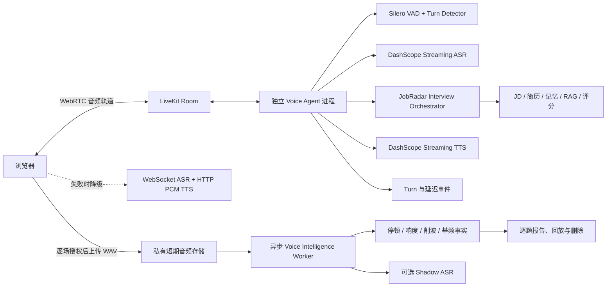
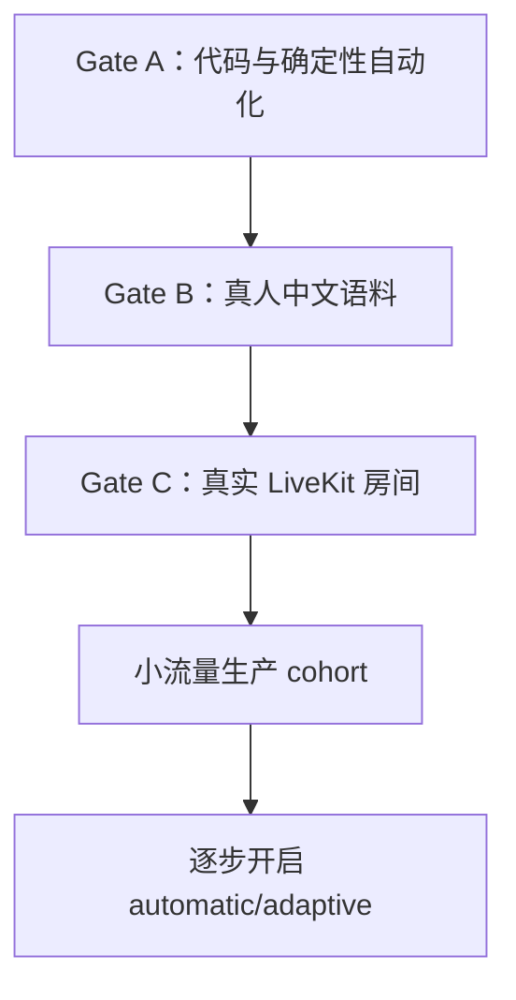

# JobRadar Voice Agent 阶段复盘与验收方案

## 0. 文档信息

- 项目：JobRadar 定制化模拟面试 Voice Agent
- 日期：2026-08-16
- 覆盖范围：Phase 0 到 Phase 4
- 当前结论：代码与自动化验收完成；真人语料和真实 LiveKit 房间验收待执行
- 非阻塞后续：Phase 5 原生语音模型 A/B 实验

关联文档：

- [实时语音架构规格](./realtime-voice-agent-spec-2026-08-16.md)
- [三层生产验收清单](./voice-agent-acceptance-2026-08-16.md)
- [Voice Intelligence 原始规划](./voice-intelligence-v1-spec-2026-07-28.md)

---

## 1. 为什么要做这套 Voice Agent

JobRadar 原有模拟面试的优势不在“能语音聊天”，而在以下领域能力：

1. 根据目标岗位、JD、简历、用户记忆和岗位知识生成定制问题。
2. 根据候选人的回答继续追问证据、职责边界、业务取舍和量化结果。
3. 保存逐题 transcript、评分依据、参考答案和最终报告。
4. 保证面试官的问题受结构化 Interview Orchestrator 控制，而不是让通用模型自由闲聊。

原系统的问题主要出现在实时语音边界：

- 浏览器通过应用层 WebSocket 上传麦克风 PCM，不是真正的实时媒体会话。
- 后端虽然分块返回 TTS，浏览器却先等待完整 `Blob`，用户听到的仍是整包音频。
- 停止播放只停了浏览器音频，没有统一取消 HTTP、TTS provider 和待生成内容。
- 沉默、咳嗽、键盘声、语气词、回答结束和主动打断容易混为一谈。
- ASR 最后一句可能在用户停止录音后才返回，旧流程会过早关闭连接。
- 原始语音指标里存在根据文字和语速让 LLM 猜“自信度”的做法，缺少标注和校准。
- 没有足够完整的 trace 来回答“慢在哪里”“为什么误打断”“用户实际听到了什么”。

因此目标不是做一个开放式语音聊天机器人，而是做一个**结构化全双工面试官**：

- 媒体传输允许输入和输出同时存在。
- 面试策略仍然由 JobRadar Orchestrator 控制。
- 用户可以打断，系统也能区分有效打断和噪声。
- 每个 committed turn 都可重建、可解释、可审计。
- 声学分析只展示可测量事实，不冒充心理判断。

---

## 2. 最终架构



核心架构决策：

1. **LiveKit 管媒体，不取代 JobRadar 业务脑。**
2. **Voice Agent 独立进程运行。** API、媒体 worker 和业务 Orchestrator 不绑在一个生命周期里。
3. **保留旧链路作为降级路径。** LiveKit 配置或连接失败时，不让整个模拟面试不可用。
4. **实时交互与离线声学分析分离。** Voice Intelligence 不能阻塞提交答案或下一题。
5. **所有高风险自动行为先放在 feature flag 后。** Push-to-talk 是第一批默认模式，自动结束和 adaptive interruption 默认关闭。

---

## 3. Phase 0：可信 ASR 证据

### 3.1 要解决的问题

旧浏览器会把 ASR 文本人工拼成连续 segment，并生成看似合理的时间戳。这导致：

- `pause_count=0` 可能只是因为系统没有真实 timing。
- `response_latency_ms=0` 可能只是默认值，而不是用户立即开口。
- 用户停止录音时，provider 的最后一句 final event 还没有到达，连接却已经关闭。

这些数据看起来“完整”，实际上不可相信。

### 3.2 具体实现

- 从 DashScope final sentence 中读取 `begin_time` 和 `end_time`，转换成可选秒数。
- 前端停止录音后先停止采集，但保留 WebSocket。
- 向 ASR provider 发送 stop，继续等待 `final` 和 `completed`。
- 设置 8 秒 finalization 超时，超时后提交已确认文本，而不是无限等待。
- 定义 typed transcript：

```json
{
  "audio_duration_s": 28.4,
  "segments": [
    {
      "start_s": 0.2,
      "end_s": 15.5,
      "text": "我先介绍一下项目背景。"
    }
  ]
}
```

- `start_s` 与 `end_s` 必须同时出现、非负且单调，否则后端返回 422。
- provider 没有 timing 时保留 `null`，只计算文字可支持的指标。

主要文件：

- `backend/app/services/interview/voice/asr.py`
- `resume-copilot-web/components/interview/voice/useRecorder.ts`
- `backend/app/routers/interview.py`
- `backend/app/services/interview/voice_metrics.py`

### 3.3 遇到的挫折

**挫折 1：停止录音不等于 ASR 已经 final。**

最初的直觉是停止麦克风后立即关闭 WebSocket，但 Paraformer 的最后一句通常需要在收到 finish 后才 final。这样会稳定丢失句尾。

解决方式是把“停止采集”和“完成识别”拆成两个状态：

```text
recording -> finalizing -> completed
```

**挫折 2：没有 timing 时，零值比空值更危险。**

零值会被报告层解释成“没有停顿、没有起答延迟”。最终决定采用 `null` 表示不可计算，禁止伪造连续 segment。

### 3.4 如何知道修好了

- final event 能保留 provider timing。
- stop 之后仍可接收 `final -> completed`。
- 缺 timing 的 transcript 不再生成零延迟、零停顿。
- 文本模式请求仍兼容。
- 恶意或错误 timing shape 被 422 拒绝。

### 3.5 完成结果

Phase 0 建立了后续所有语音分析的可信数据契约。系统不再用“看起来完整”的假 timing 掩盖信息缺失。

---

## 4. Phase 1：真正的流式 TTS 与取消

### 4.1 要解决的问题

旧链路的后端已经按 chunk 输出语音，但浏览器代码是：

```text
fetch -> 等待完整 Blob -> 创建 audio URL -> 播放
```

因此它只是“网络分块”，不是“用户可感知的流式播放”。此外，点击停止只会暂停 `<audio>`，provider 和 HTTP 流仍可能继续生产无用数据。

### 4.2 具体实现

- 为 TTS API 增加 `format=pcm`。
- CosyVoice 返回 22,050 Hz、mono、signed 16-bit little-endian PCM。
- 浏览器用 `ReadableStream` 增量读取 response body。
- `PcmStreamPlayer` 将每批 PCM 转成 `AudioBuffer`，按时间轴连续调度。
- 第一个音频 chunk 到达后立即安排播放，不等待完整响应。
- `stop()` 同时执行：
  - `AbortController.abort()` 终止 HTTP fetch。
  - 停止所有已调度的 `AudioBufferSourceNode`。
  - 清空待播放队列和奇数字节缓存。
  - 关闭当前 provider iterator。
- 保留完整 WAV 路径作为兼容 fallback。
- 增加非持久化客户端 telemetry：
  - request to headers
  - request to first byte
  - request to first audio
  - stream download
  - playback complete
  - cancelled
  - fallback used

主要文件：

- `backend/app/services/interview/voice/tts.py`
- `resume-copilot-web/components/interview/voice/PcmStreamPlayer.ts`
- `resume-copilot-web/components/interview/voice/useTTSPlayer.ts`

### 4.3 遇到的挫折

**挫折 1：后端 streaming 不代表前端真的 streaming。**

通过实际测量才确认瓶颈在浏览器 `await blob()`，因此必须更换播放模型，而不是继续优化后端 chunk 大小。

**挫折 2：网络 chunk 不保证按 16-bit sample 对齐。**

一个 chunk 可能以奇数字节结尾，下一 chunk 才包含该 sample 的高字节。直接转 `Int16Array` 会造成爆音和样本错位。

解决方式是在 `PcmStreamPlayer` 中保留 `pendingByte`，与下一 chunk 的首字节合并。

**挫折 3：消费者取消后，producer 可能堵在满队列。**

CosyVoice WebSocket pump 在后台线程生产音频。如果浏览器断开后 iterator 不再消费，固定队列会填满并让线程无法结束。

解决方式是增加共享 cancellation event，队列写入采用带超时重试；iterator close 时设置取消标记，让 producer 退出。

**挫折 4：不同 TTS provider 的能力不相同。**

Qwen3 TTS HTTP 路径返回完整 WAV URL，不能提供相同的 raw PCM contract。系统没有假装它支持 streaming，而是明确限制 raw PCM 走 CosyVoice，不支持时回退 WAV。

**挫折 5：上一轮 progress 会污染下一轮。**

新问题开始时，旧问题的 `progress=1` 可能让 UI 误以为新 TTS 已播放完成。增加按轮次重置的 `ttsPlayedRef`，只有本轮真的进入过播放状态才允许 commit。

### 4.4 如何知道修好了

- 首个 PCM chunk 在 HTTP response 完成前被调度。
- stop 会同时终止 fetch、已排程声音和 provider iterator。
- 第二次 `speak()` 不会播放上一次请求的残留声音。
- 奇数字节边界测试不破坏 PCM。
- WAV fallback 仍可工作。
- 经 Next.js `/api` proxy 后仍是 chunked response，不被代理整包缓冲。

### 4.5 完成结果

- 真实 CosyVoice smoke：首个 8,000-byte PCM chunk 约 400.5 ms。
- 经 Next.js proxy：首字节约 616.6 ms，完整响应约 2.32 秒。
- Headless Chromium 能在 PCM 请求结束后进入可回答状态。
- 仍需真人耳听连续性和真实 stop latency，因为 headless Chromium 静音不能替代听感验收。

---

## 5. Phase 2：迁移到 LiveKit WebRTC

### 5.1 为什么选择 LiveKit

技术选型时把 Moshi、TEN、LiveKit、Pipecat 等放在不同层看待：

- 原生 speech-to-speech 模型解决模型能力问题。
- TEN、Pipecat、LiveKit Agents 解决 agent pipeline 编排问题。
- LiveKit 同时提供 WebRTC 媒体层、房间、token、重连、音轨和 Agents runtime。

JobRadar 已有成熟的 Interview Orchestrator，不适合为了原生语音模型重写业务脑。因此采用：

```text
LiveKit 负责实时媒体和 session
DashScope 继续负责中文 STT/TTS
JobRadar Orchestrator 继续负责问题、追问、评分和报告
```

### 5.2 具体实现

- 新增独立 LiveKit Agents Python worker。
- 将现有 DashScope ASR/TTS 封装成 LiveKit adapter。
- 新增 `POST /api/interview/realtime/session`：
  - 校验会话所有权。
  - 校验用户额度和并发会话数。
  - 生成 10 分钟 room-scoped token。
  - 房间最多两名参与者。
  - 只 dispatch 指定 JobRadar agent。
- JD、user key、target job 保存在服务端 context 表，token 只携带随机 `context_id`。
- 重发同一 session 会 supersede 旧 context，防止多个 agent 同时处理同一面试。
- 浏览器通过 LiveKit local/remote track 收发音频。
- 使用 participant transcription 更新 UI。
- 提供 RPC：
  - `jobradar.commit_user_turn`
  - `jobradar.interrupt`
  - `jobradar.clear_user_turn`
  - `jobradar.repeat_question`
- LiveKit 初始化失败或中途断开时回落到 Phase 1 链路。
- 使用 OpenTelemetry/Prometheus 和 `interview_realtime_events` 记录状态、turn、EOU、overlap、模型指标和错误。

主要文件：

- `backend/app/services/interview/voice/livekit_agent.py`
- `backend/app/services/interview/voice/livekit_adapters.py`
- `backend/app/services/interview/voice/livekit_session.py`
- `resume-copilot-web/components/interview/voice/useLiveKitInterview.ts`
- `backend/alembic/versions/f8b1d4c6e2a9_interview_realtime_voice_sessions.py`

### 5.3 遇到的挫折

**挫折 1：不能把完整业务上下文塞进浏览器 token。**

JD、用户身份和业务上下文进入 token 会扩大泄露面。最终 token 只授权一个 room，业务上下文由 agent 使用 `context_id` 从服务端读取。

**挫折 2：Realtime 初始化失败可能造成第一题重复。**

浏览器先尝试 LiveKit，失败后 legacy effect 也可能再次 bootstrap。通过初始化 guard、context supersede 和 fallback 状态控制，保证降级只进入一次旧链路。

**挫折 3：媒体会话和业务 turn 不是同一个生命周期。**

WebRTC 可以重连，但 Interview Orchestrator 的 turn 必须保持唯一。系统将 room context、realtime event 和 `InterviewTurn` 分表保存，避免把网络重连误当成新业务 turn。

**挫折 4：本地没有 LiveKit credentials。**

没有伪造“真实房间已经通过”。实现了 feature-enabled/no-credentials smoke：API 返回 503，浏览器自动回落，且只生成一道第一题。真实房间 latency 和 reconnect 被明确列为外部验收项。

### 5.4 如何知道修好了

- token 是短期、room-scoped，不能加入其他 room。
- JD 和 user key 不进入浏览器 credential。
- session ownership、并发 quota、supersede 都有测试。
- worker CLI、模型文件下载和模块编译通过。
- 浏览器 feature-on/no-credential 路径能自动 fallback，无重复首题。
- desktop 与 390 px mobile 无水平溢出或控件重叠。

### 5.5 完成结果

WebRTC 代码、worker、授权、浏览器集成、fallback 和可观测性均已完成并受 feature flag 控制。真实 LiveKit room 尚未签字，原因是缺少部署 credentials，不是代码路径被跳过后宣称成功。

---

## 6. Phase 3：智能结束、打断和 Barge-in

### 6.1 要解决的问题

“检测到声音”不等于：

- 用户已经开始一个有效回答。
- 用户已经结束回答。
- 用户想打断面试官。

咳嗽、键盘、回声、短促“嗯”、长停顿和主动插话需要不同策略。

### 6.2 具体实现

- 16 kHz Silero VAD 提供 speech activity。
- automatic mode 使用 LiveKit 中文音频 Turn Detector，并保留 local fallback。
- manual push-to-talk 保持默认和永久 fallback。
- 自动结束和 adaptive interruption 使用独立 server feature flag。
- 打断需要：
  - 至少 550 ms speech。
  - 至少一个 transcript unit。
  - 经过约 1 秒 AEC warmup，防止面试官刚开口时扬声器回声触发。
- 开启 echo cancellation、noise suppression、automatic gain control。
- false interruption 在配置超时后恢复。
- 打断时取消 LiveKit playback、TTS iterator、Orchestrator HTTP stream 和待生成 reply。
- 额外保存：
  - `question_heard_text`
  - `question_interrupted`
  - `realtime_transport`
- 生成固定 checksum 的 WAV fixtures：
  - silence
  - background noise
  - keyboard impulses
  - short filler
  - cough-like burst
  - sustained overlap
  - two phrases with known pause

### 6.3 遇到的挫折

**挫折 1：VAD 只能判断 activity，不能判断对话轮次是否自然结束。**

只依赖静音阈值会把思考停顿当作结束。最终把 VAD、Turn Detector、minimum/maximum delay 和 manual commit 组合，而不是让一个 threshold 决定一切。

**挫折 2：扬声器回声可能被当作用户 barge-in。**

除了浏览器 AEC，还增加 warmup、minimum speech duration 和 transcript guard。短噪声可以产生能量，但不能直接 commit interruption。

**挫折 3：Preemptive generation 与现有 Orchestrator 冲突。**

LiveKit 支持 speculative generation，但 `/api/interview/turn` 会持久化 `InterviewTurn`。如果 speculative call 被取消后重试，可能生成重复问题或重复 DB 行。

最终选择关闭 preemptive generation。只有把 Orchestrator 改造成纯规划和显式 commit 两阶段接口后，才适合重新开启。

**挫折 4：完整问题不等于用户实际听到的问题。**

用户中途打断时，如果历史里仍保存完整 TTS 文本，后续评分和审计会误判上下文。因此将 intended question 与 heard text 分开持久化。

**挫折 5：合成 fixture 不能代表真人中文表达。**

Fixture 只用于回归“代码有没有退化”，不能证明 false endpoint 或 false barge-in 已达到生产阈值。因此 Phase 3 的 runtime 完成，但真人校准仍是 release gate。

### 6.4 如何知道修好了

- silence、背景噪声、键盘、短 filler 和 cough 不会通过有效 interruption guard。
- sustained overlap 能触发预期的打断路径。
- manual/automatic 配置按 server flag 生效。
- preemptive generation 在所有模式下都明确为 false。
- RPC caller 必须是该 room 的 candidate identity。
- question interruption 状态和实际 heard text 可在 DB 中审计。

### 6.5 完成结果

Phase 3 的策略、代码、feature flag 和确定性 fixture 已完成。自动模式和 adaptive interruption 第一批上线时仍默认关闭，待真人语料和真实房间测量后逐步放量。

---

## 7. Phase 4：Voice Intelligence 与隐私闭环

### 7.1 要解决的问题

系统需要给用户提供语音表达反馈，但不能：

- 默认永久保存原始音频。
- 让音频脱离 session/turn 所有权。
- 把实时交互拖慢。
- 用未经校准的规则或 LLM 输出“你不自信”“性格不稳定”。

### 7.2 隐私与数据生命周期

- 默认关闭语音保存。
- 用户每场面试通过明确弹窗授权。
- 不授权不影响语音面试和 transcript-only 报告。
- 每个 artifact 绑定：
  - `user_key`
  - `session_id`
  - `turn_index`
  - `consent_version`
- 原始 WAV 存在 SQLite 外的私有目录，目录权限 700、文件权限 600。
- SQLite 只保存 metadata、checksum、状态、过期时间和分析结果。
- 默认保留 7 天，可配置。
- 支持单题删除、整场撤回、定时过期清理。
- 用户删除会同时清除物理文件和派生特征。
- 音频目录加入 `.gitignore`，防止误提交。
- replay API 再次校验 user key，并使用 `private, no-store`。

### 7.3 异步分析

当前 `voice-facts-v1` 输出：

- 总时长
- 首次 speech 时间
- speech duration / voiced ratio
- segment 数量
- 500 ms 以上长停顿数量、总时长、平均值、最大值
- articulation CPM
- speech RMS / mean dBFS
- dynamic range
- clipping ratio
- autocorrelation F0 的 median、p10、p90
- quality flags

它不会输出 confidence/personality label。

Shadow ASR：

- 受 `VOICE_SHADOW_ASR_ENABLED` 单独控制，默认关闭。
- 只做 transcript quality comparison。
- 记录 normalized character error rate。
- 永远不能覆盖 realtime transcript。

主要文件：

- `backend/app/services/interview/voice_intelligence.py`
- `backend/alembic/versions/9d4a6c2e7b10_interview_audio_artifacts.py`
- `resume-copilot-web/components/interview/voice/PcmWavCapture.ts`
- `resume-copilot-web/components/interview/InterviewReport.tsx`
- `backend/scripts/evaluate_voice_intelligence.py`

### 7.4 遇到的挫折

**挫折 1：原来的 confidence score 不可产品化。**

旧实现把 transcript 和 cadence 发给 LLM，让它返回 0-100 自信度。它没有标注集、inter-rater agreement、校准曲线或 drift 证据。

最终处理：

- 停止生产该字段。
- API 返回历史 `voice_metrics` 时主动剔除旧字段。
- 报告只写“客观语音记录”。
- 文案明确说明不推断性格或自信度。

**挫折 2：简单能量阈值最初把持续低背景噪声识别成 speech。**

Fixture 第一次运行时，`background_noise.wav` 被判断为持续 speech。修复包括：

- 自适应 threshold 同时参考 noise floor 与高能量分位数。
- 对极低 high-energy 输入直接标记为 low input，不当作有效回答。
- 只在最终 speech segment 上计算能量统计。
- 把 silence、背景噪声和 keyboard impulses 纳入 executable gate。

**挫折 3：FastAPI BackgroundTasks 没有完全脱离请求生命周期。**

真实 smoke 中，分析本身只需毫秒，但遇到 SQLite 写锁时，一次上传请求的访问日志达到约 25 秒。202 语义不应该依赖分析何时结束。

最终改成有界异步队列和两个独立 daemon worker：

- 上传落盘并写 metadata 后立即返回 202。
- worker 在请求外打开自己的 DB session。
- queue 上限为 256，避免无限积压。
- `uploaded/analyzing` 状态在进程启动和定时任务中重新入队。

**挫折 4：ThreadPoolExecutor 会拖住 Uvicorn 退出。**

第一次解耦使用标准线程池，但其非 daemon worker 在 SQLite 等待场景中会拖住进程 shutdown。随后改成 bounded queue + daemon workers；未完成任务依靠 DB 状态在下次启动恢复。

最终验证：有分析 worker 时 Uvicorn 可以在 1 秒内退出。

**挫折 5：报告生成可能与最后一题分析存在 race。**

报告不应等待声学分析，但也不能永久漏掉 pending artifact。报告现在可以返回 `uploaded/analyzing` 记录，前端轮询 artifact detail，ready 后更新客观指标。

**挫折 6：LiveKit 和 legacy 两条录音路径都要遵守同一 consent。**

如果只改旧 WebSocket recorder，切到 WebRTC 后会丢失 Voice Intelligence。最终抽出 WAV encoding/capture 工具：

- legacy recorder 收集发送给 ASR 的 PCM 副本。
- LiveKit 从已有 local microphone track 建立旁路 AudioWorklet capture。
- 两条路径都只在授权开启时生成 WAV。

### 7.5 如何知道修好了

- 未授权请求返回 422，磁盘没有文件。
- 空 user key 返回 401。
- artifact 必须绑定已存在 turn。
- 其他 user key 读取或回放返回 403。
- 删除后物理文件不存在、features 清空、replay 返回 410。
- 过期清理只删除到期 artifact。
- 相同 WAV 两次分析结果一致。
- Shadow ASR 关闭时明确记录 `disabled`。
- 上传接口真实服务约 44 ms 返回 202。
- 约 300 ms 后 artifact 进入 ready。
- 服务 shutdown 不等待分析 worker。
- 390 px 浏览器完成默认关闭、授权、上传、撤回删除，无水平溢出和 page error。

### 7.6 完成结果

- Phase 4 代码、migration、定时清理、报告和 UI 完成。
- 开发数据库已升级到 Alembic `9d4a6c2e7b10` 单一 head。
- 测试后私有音频目录残留文件数为 0。
- 7 个 checksum-pinned acoustic fixtures 返回 `go`。
- p95 processing real-time factor 为 `0.0064`，低于 `0.5` gate。

---

## 8. 当前 Feature 完成矩阵

| 能力 | 实现状态 | 默认策略 | 还需什么验收 |
| --- | --- | --- | --- |
| Streaming ASR | 已完成 | 开启 | 真人 final-loss 测试 |
| Streaming PCM TTS | 已完成 | legacy 可用 | 真人听感与 stop latency |
| WebRTC 全双工媒体 | 已完成，flag 后 | 关闭 | 真实 LiveKit room |
| Push-to-talk commit | 已完成 | 默认 | 真实 room smoke |
| 用户显式打断 | 已完成 | 可用 | barge-in p95 |
| 自动 end-of-turn | 已完成，flag 后 | 关闭 | 真人 false endpoint |
| Adaptive interruption | 已完成，flag 后 | 关闭 | 噪声/回声校准 |
| Reconnect/fallback | 已完成 | 自动 fallback | 多浏览器网络测试 |
| 实际 heard-text 审计 | 已完成 | 开启 | 真实中断一致性 |
| 音频授权/删除/过期 | 已完成 | 默认不授权 | 删除抽检 |
| 客观 Voice Intelligence | 已完成 | 授权后开启 | 真人 timing 误差 |
| Shadow ASR | 已完成，flag 后 | 关闭 | CER 与关键词 recall |
| Confidence/personality label | 未发布 | 禁止展示 | 需要监督数据与校准 |
| Native speech-to-speech | Phase 5 实验 | 不启用 | A/B 后再决策 |

---

## 9. 验收总体原则

验收分为三层，因为单元测试不能证明真人体验，真人录音也不能证明 WebRTC 网络恢复。



发布规则：

- Gate A 失败：不进入真人验收。
- Gate B 失败：继续使用 manual push-to-talk，不开启 automatic/adaptive。
- Gate C 失败：保持 legacy 链路，不能宣称 WebRTC production-ready。
- A-C 全绿后才能给第一批 production cohort 签字。

---

## 10. Gate A：自动化验收

### 10.1 执行内容

后端：

```bash
cd backend
PYTHONPATH=. .venv/bin/pytest -q \
  tests/test_interview_voice_intelligence.py \
  tests/test_interview_livekit_voice.py \
  tests/test_interview_tts_streaming.py \
  tests/test_interview_asr_websocket.py \
  tests/test_interview_router_turn.py \
  tests/test_interview_turns_endpoints.py \
  tests/test_interview_orchestrator.py \
  tests/test_voice_metrics.py \
  tests/test_interview_report_aggregation.py

PYTHONPATH=. .venv/bin/python scripts/evaluate_voice_intelligence.py
PYTHONPATH=. .venv/bin/alembic heads
PYTHONPATH=. .venv/bin/alembic current
```

前端：

```bash
cd resume-copilot-web
npx tsc --noEmit
npm run lint
npm run build
```

浏览器 smoke：

1. 创建新 session。
2. 确认 consent 默认 false，artifact count 为 0。
3. 打开授权弹窗，确认包含可选、用途、7 天和立即删除说明。
4. 上传固定 WAV，确认 202、uploaded/analyzing、ready 状态流转。
5. 撤回授权，确认 status=deleted、replay=410。
6. 在 390 px viewport 检查 overflow 和 page error。

### 10.2 Gate A 阻塞条件

- 没有明确授权却写入 WAV。
- 其他 user 可以读取 artifact。
- 删除后物理文件仍存在。
- 音频分析阻塞下一题或报告。
- API 或 UI 泄漏未校准 confidence label。
- silence/noise/keyboard 被识别为有效长回答。
- migration 不是单一 head。
- production build 失败。

### 10.3 当前结果

- 后端聚焦回归：`55 passed`。
- Voice Intelligence fixture gate：`go`。
- fixture 数量：7。
- processing RTF p95：`0.0064`。
- TypeScript：通过。
- ESLint：0 errors，3 个与本改动无关的既有 warnings。
- Next.js production build：通过。
- Alembic：`9d4a6c2e7b10 (head)`。
- 移动端 browser smoke：通过，无 overflow、无 page error。
- Gate A 结论：**通过**。

---

## 11. Gate B：真人中文语料验收

### 11.1 数据集计划

至少收集：

- 20 名普通话说话人。
- 每人至少 5 个 turn。
- 总计不少于 100 个 consented turns。
- 覆盖不同性别、音高、语速、麦克风、房间和距离。

场景必须包含：

- 正常完整回答。
- 0.5、1、1.5、2 秒思考停顿。
- “嗯、啊、那个、然后”等 filler。
- 刻意轻声、正常声、较大声。
- 投行、行研、咨询、AI Agent 等专业词汇。
- 咳嗽、敲键盘、椅子移动和背景人声。
- 面试官说话时主动 barge-in。
- 误触麦克风和中途取消。

### 11.2 标注方法

每条录音由两名 reviewer 独立标注：

- first speech time
- last speech time
- 每个长停顿区间
- transcript
- finance/AI keyword 列表
- 是否有效回答
- 是否有主动 interruption intent
- 是否出现 echo/noise false trigger

Reviewer disagreement 必须先仲裁，模型输出不能反过来作为 ground truth。

### 11.3 通过指标

| 指标 | 目标 |
| --- | --- |
| stop 后最后一句丢失 | 0 / 100 |
| first/last speech boundary MAE | <= 150 ms |
| 长停顿检测 F1 | >= 0.90 |
| false endpoint rate | < 2% |
| false barge-in rate | < 1% |
| 专业关键词 recall | >= 95% |
| Shadow ASR CER 回退 | 不比 realtime ASR 差超过 2 个百分点 |
| 删除请求物理文件消失 | 100% |
| 未校准心理判断 | 0 条 |

### 11.4 失败后的处理

- boundary 误差高：调 VAD threshold、minimum speech 和 post-padding。
- filler 导致误结束：用真人 corpus 检查 Audio EOT 校准，并调整 endpointing min/max delay。
- echo 导致误打断：增加 AEC warmup 或提高 interruption duration。
- 某类麦克风低音量漏检：按设备/能量质量标记，不直接扩大所有阈值。
- Shadow ASR 专业词差：建立岗位术语测试集和 provider vocabulary strategy。

### 11.5 当前状态

验收协议与指标已完成，真人 corpus 尚未采集。因此 Phase 3 automatic/adaptive 和任何“表达判断”不能宣称完成生产校准。

---

## 12. Gate C：真实 LiveKit 房间验收

### 12.1 环境

浏览器：

- Chrome desktop
- Safari desktop
- iOS Safari
- Android Chrome

网络：

- 普通 Wi-Fi
- 150 ms RTT
- 有限带宽
- 1%-3% packet loss
- 短时断网后恢复

每个浏览器至少运行一个 20 分钟面试，另做 30 次定向 interruption/reconnect trials。

### 12.2 关键时间点

每个 turn 记录：

```text
user speech start
user speech end
VAD end
turn detector commit
STT final
orchestrator request
LLM/Orchestrator first token
TTS first byte
first audible audio
interruption requested
audible playback stopped
room reconnect start/end
```

### 12.3 通过指标

- 回答结束到首个面试官音频：p95 < 1.5 秒。
- 用户 barge-in 到面试官声音停止：p95 < 300 ms。
- reconnect 在 5 秒内完成。
- reconnect 后没有重复问题或重复答案。
- 新 turn 开始后没有旧 TTS 残留。
- transcript、heard text 和 interruption event 一致。
- LiveKit 建连失败只 fallback 一次，不重复第一题。
- provider credentials 不出现在浏览器、localStorage 或日志。
- desktop 与 390 px mobile 无重叠和水平溢出。

### 12.4 当前状态

无 credentials 路径和 legacy fallback 已验证。真实 LiveKit room 需要部署 URL、API key、secret 和 agent worker 后执行，因此当前不能对真实房间 latency、barge-in p95 或 reconnect 指标签字。

---

## 13. 上线与灰度计划

### Cohort 0：内部工程验证

- LiveKit feature flag 仅内部账号开启。
- manual push-to-talk。
- automatic turn detection 关闭。
- adaptive interruption 关闭。
- Voice Intelligence 默认不授权。

### Cohort 1：小规模真人面试

- 10-20 名明确同意的测试用户。
- 保持 manual commit。
- 收集 Gate B/C 数据。
- 每天审计 false endpoint、barge-in、fallback 和 deletion。

### Cohort 2：automatic shadow

- Turn Detector 只记录“如果自动提交会在什么时候”，不真的提交。
- 与用户 manual commit 时间比较。
- 达到 Gate B 后才真正开启 automatic mode。

### Cohort 3：adaptive interruption 小流量

- 先在支持的浏览器和音频设备上开启。
- 实时监控 false interruption 和 resume 次数。
- 超阈值自动回退 VAD/manual 策略。

---

## 14. Phase 5 为什么不属于当前上线阻塞项

Phase 5 是把中文原生 realtime speech model 与当前 cascaded path 做 A/B：

```text
A：Streaming STT -> JobRadar Orchestrator -> Streaming TTS
B：Native speech model -> JobRadar tools/Orchestrator contract
```

两组必须使用相同：

- interview policy
- transcript audit
- shadow STT
- question-control contract
- report evidence contract

只有 B 同时改善 latency 和 naturalness，且不降低 transcript、问题控制、工具使用和审计能力时才可晋升。当前 cascaded path 通过 A-C 后即可上线，不需要等待 Phase 5。

---

## 15. 最终结论

### 已完成

- Phase 0：可信 ASR timing 和 stop-finalization contract。
- Phase 1：浏览器可感知的 PCM streaming 和端到端取消。
- Phase 2：LiveKit worker、WebRTC browser、room authorization、reconnect/fallback 和观测。
- Phase 3：Silero VAD、中文 Turn Detector、barge-in policy、false interruption recovery 和 heard-text 审计。
- Phase 4：明确授权、短期留存、访问控制、删除/过期、异步客观声学分析、Shadow ASR contract 和报告证据链。
- 自动化 Gate A：通过。

### 尚未完成生产签字

- 100 条以上真人中文语料 Gate B。
- 真实 LiveKit 房间的 latency、barge-in 和 reconnect Gate C。
- 任何 confidence/personality label 的监督学习与校准。

因此最准确的项目状态是：

> **功能和工程闭环已经完成，自动化验收已通过；生产级实时语音体验仍需真人语料与真实 LiveKit 部署完成最后两层签字。**
